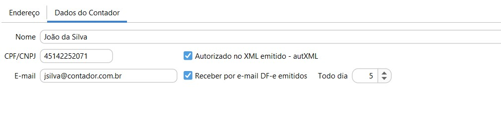

[Início](index.md) / [Administração](administracao.md) / Empresa

{: #empresa}

### Empresa

No cadastro da empresa deve se atentar a correta inserção dos números de registros e endereço pois serão enviados à Sefaz por meio do documento fiscal eletrônico emitido.

{: #dadoscontador}

#### Dados do Contador

`Autorizado no XML emitido - autXML` ao marcar este campo o CPF ou CNPJ informado será levado para o XML na tag <autXML>, autorizando assim a consulta do XML da NF-e no Portal Nacional.

`Receber por e-mail DF-e emitidos` ao marcar este campo o sistema fará o envio automático de um e-mail com o XML de todos os Documentos fiscais emitidos no último mês completo juntamente com um relatório de documentos emitidos no mesmo período. 

O e-mail será enviado para o endereço informado no campo e-mail as 00:00h do dia parametrizado no campo`Todo dia` .

Os e-mails enviados podem ser consultados através da tela de [Histórico e-mail enviado](administracao_historico_email_enviado.md) no menu Administração. Os e-mails enviados pelo processo de Envio automático ao Contador tem Origem "Anexo com NF-e". A pesquisa pode ser feita ainda pelo endereço de e-mail do destinatário ou pelo assunto:

[Voltar](administracao.md)