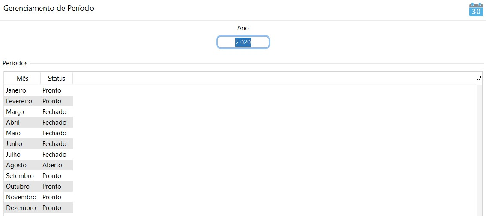
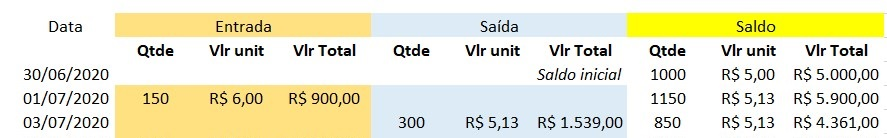
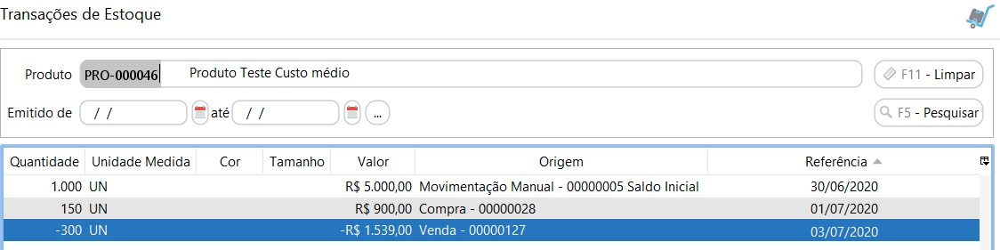
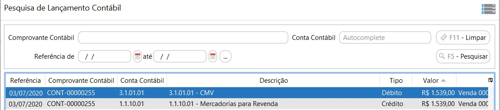

[Início](index.md) / [Administração](administracao.md) / Período

{: #periodo}

### Período

O objetivo do período é impedir que lançamentos sejam feitas em datas indevidas e calcular o último saldo contábil e [custo médio](administracao_periodo.md#customedio) dos produtos.

Para que seja realizada uma transação no CN, o período que está sendo feito a transação deve estar em aberto, caso contrário o sistema emitirá o alerta de erro solicitando a abertura do período. **Orientamos sempre manter somente o período atual com status Aberto.**

{: #customedio}

#### Custo médio

##### O que é?

O custo médio ou custo médio ponderado, representa o valor da média dos gastos com a compra de cada produto. 

##### Como é calculado?

A cada movimentação de entrada de um produto no estoque, o sistema realizará o cálculo automático do custo médio.

As movimentações de entrada contempladas são:

Lançamento manual de compra: o custo será o Valor dos produtos +Frete+Seguro+ICMS ST+IPI

Lançamento manual de entrada via Movimentação manual de estoque: o custo será o custo total informado manualmente.

###### *Fórmula:* 

*Custo médio: (Custo total da entrada + Valor do estoque anterior) / (Quantidade da entrada + Saldo de estoque anterior)*

​                          

##### Onde é usado?

É com base no custo médio de cada produto que será executada a transação e contabilização de estoque na Venda, essa forma de análise é chamada de custo médio ponderado móvel, ou seja, o custo de cada venda, varia a cada alteração no inventário.

###### *Registro de estoque:*

Abaixo um exemplo de registro de estoque executado pelo custo médio ponderado móvel:

Pode-se observar que na Venda executada no dia 03/07/2020 a mercadoria saiu do estoque já com o custo médio.

Aplicando a fórmula temos:

​                                            Custo médio: 900,00 + 5000,00 / 150+1000 = 5,13

##### Analisando as transações no CN

Vamos analisar a venda executada no exemplo de registro de estoque, onde o produto tem um custo médio de R$5,13 e quantidade vendida foi 300.  

A transação de saída de estoque será de R$1539,00, que é R$5,13 x 300.

A contabilização do estoque na venda será do mesmo valor da transação do estoque, onde teremos então:

 Contabilização do estoque: D- Custo da mercadoria vendida R$1539,00

​                                                   C- Estoque de mercadoria R$1539,00

​                                    

[Voltar](administracao.md)