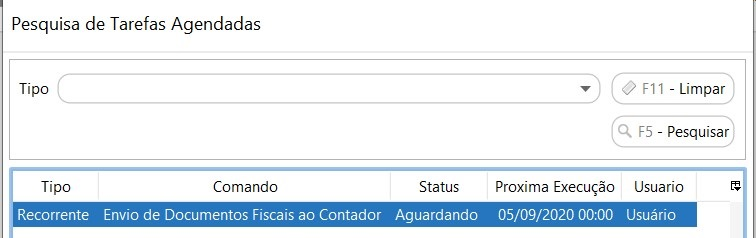

[Início](index.md) / [Administração](administracao.md) / Tarefa Agendada

{: #tarefaagendada}

### Tarefa Agendada

Esta é uma tela para consulta das tarefas que estão agendadas para serem executadas automaticamente pelo sistema.

Ao marcar o campo Receber por e-mail DF-e emitidos, em dados do contador no cadastro da empresa, o sistema irá criar uma tarefa agendada que será executada no dia parametrizado

[Voltar](administracao.md)