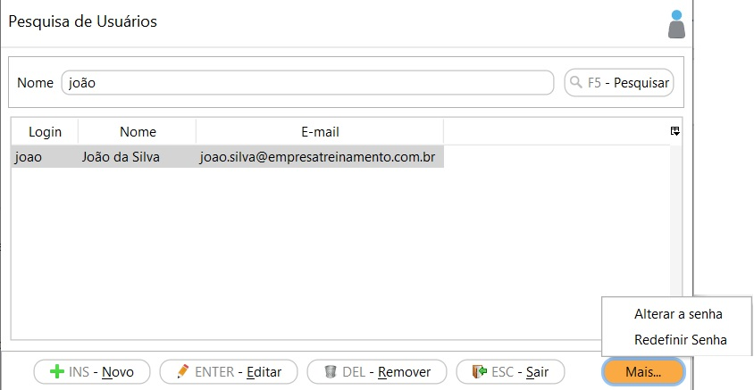

[Início](index.md) / [Administração](administracao.md) / Usuário

{: #usuário}

### Usuário

No cadastro de usuário são cadastrados os usuários que tem acesso o sistema. O número de usuários permitidos varia de acordo com a licença.

Através do botão `Mais` ou clicando com o botão inverso do mouse é possível fazer a alteração ou redefinição das senhas de usuários. 

