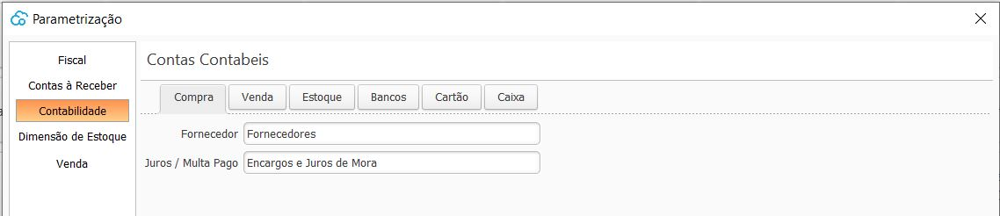

Ajustes de Contabilidade
------------------------
Nesta tela são parametrizadas as contas contábeis utilizadas em todas as transações do sistema.

_Conceitos iniciais:_

Conta sintética : representa o somatório de lançamentos de um grupo da mesma natureza, não recebe lançamentos diretamente.
Conta analítica: representa o detalhamento das transações, recebe lançamentos diretamente.

A organização desta tela é feita em guias, onde temos:

* *Estoque*

- Custo de mercadoria: Conta Contábil de Resultado (Despesa), Tipo analítica.

- Estoque padrão: Conta Contábil do Ativo Circulante, Tipo analítica.

- Exceções: através do botão Novo podem ser configuradas as contas de Estoque que não se enquadram na conta de estoque padrão, podendo ser parametrizado por Produto, Grupo ou Subgrupo de produto.

* *Vendas*

- Cliente: onde é lançado os valores à receber de clientes, Conta Contábil do Ativo Circulante, Tipo analítica.

- Juros\Multas recebido: onde é lançado os valores de juros e multa provenientes de recebíveis de clientes. Conta Contábil de Resultado (Receita) Tipo analítica

- Receita padrão: onde é lançado a receita de vendas, Conta Contábil de Resultado (Receita) Tipo analítica

- Exceções: através do botão Novo podem ser configuradas as contas de receita que não se enquadram na conta de estoque padrão, podendo ser parametrizado por Produto ou Subgrupo de produto.

* *Caixas*

- Conta contábil: Conta Contábil do Ativo Circulante, tipo sintética. Quando for cadastrado o Caixa será criado e amarrado automaticamente a este uma conta contábil analítica filha desta conta sintética parametrizada.

- Movimentação manual de Caixa: cadastro dos motivos de movimentação manual de caixa, podendo ser uma entrada ou saída. Esse motivo é amarrado há uma conta contábil, que será a contrapartida da conta de caixa. exemplo: Telefone, que é quando se tira dinheiro do caixa para pagamento da fatura de telefone.
+
image::images/aju_contab_caixas_motivos.JPG[alt]

* *Compras*

- Fornecedor: onde é lançado os valores à pagar para fornecedores, Conta Contábil do Passivo Circulante, Tipo analítica.

- Juros\Multas pago: onde é lançado os valores de juros e multa pagos para fornecedores. Conta Contábil de Resultado (Despesa) Tipo analítica

* *Bancos*

- Conta contábil: Conta Contábil do Ativo Circulante, tipo sintética. Quando for cadastrado o Banco será criado e amarrado automaticamente a este uma conta contábil analítica filha desta conta sintética parametrizada.

  [Voltar](index.md)

  