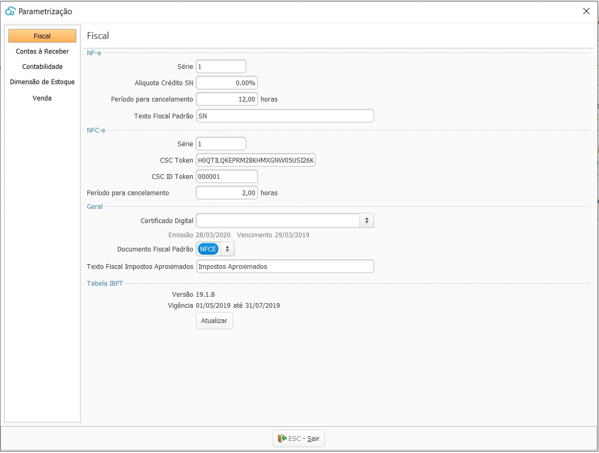

## Ajustes Fiscal

As parametrizações fiscais devem ser feitas para cada empresa cadastrada. 

Estão divididas em:

- [NFe](ajustes_fiscal_nfe.md)
- [NFCe](ajustes_fiscal_nfce.md)
- [Geral](ajustes_fiscal_geral.md)
- [Tabela IBPT](ajustes_fiscal_tabelaibpt.md)

[Voltar](sistema.md)

