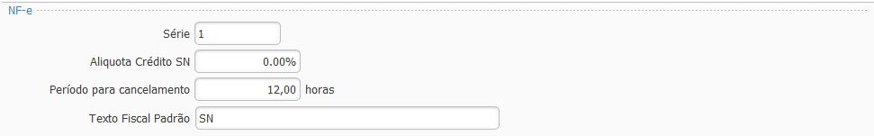
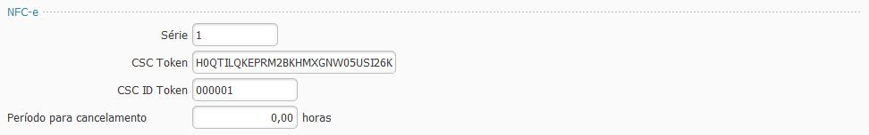
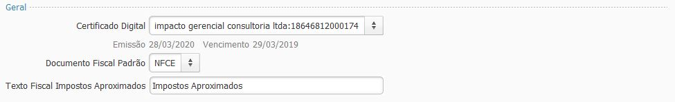
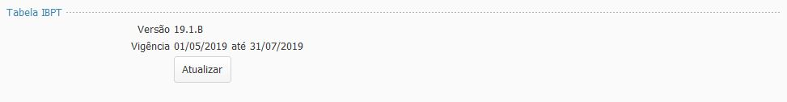

## Ajustes Fiscal

As parametrizações fiscais devem ser feitas para cada empresa cadastrada e estão divididas em:

#### Ajustes Fiscal - NFe

`Série` deve ser preenchido para as empresa emitentes de [NF-e](nfe.md).

`Alíquota Crédito SN` deve ser preenchido com a alíquota para as empresas do [SImples Nacional](simples_nacional.md) que permitem crédito de ICMS.

`Período para cancelamento` deve ser preenchido com o período que a empresa deseja permitir fazer o cancelamento de NF-e, deve ser igual ou menor ao período permitido pelo [SEFAZ](sefaz.md).

`Texto Fiscal Padrão` deve ser preenchido com algum [Texto fiscal](texto_fiscal.md), tipo [Fisco](texto_fiscal_fisco.md) que será impresso em todas as NF-e emitidas. Parâmetro não obrigatório.

#### Ajustes Fiscal - NFCe

`Série` deve ser preenchido para as empresa emitentes de [NFC-e](nfce.md)

`CSC Token`  O Código de Segurança do Contribuinte (CSC) token é um código de segurança alfanumérico (uma senha), de conhecimento exclusivo do contribuinte e da [SEFAZ](sefaz.md)  usado para garantir a autoria e a autenticidade do DANFE NFC-e. 

Na maioria dos casos, é obtido pelo site da Sefaz do estado, separando entre ambiente de homologação e de produção. 

- **Paraná (PR):** 

Para o estado no PR está disponível no [Portal RECEITA/PR](https://receita.pr.gov.br/login), em Serviço: Menu DF-e /NFC-e / CSC / Controle.

`CSC ID Token` O Código de Segurança do Contribuinte (CSC) ID é um código complementar ao Token e deve ser obtido juntamente com o Token.

`Período para cancelamento` deve ser preenchido com o período que a empresa deseja permitir fazer o cancelamento de NFC-e, deve ser igual ou menor ao período permitido pela SEFAZ.

#### Ajustes Fiscal - Geral

`Certificado Digital`

`Documento Fiscal Padrão` o tipo parametrizado será utilizado como padrão no cadastro dos Clientes, podendo, se necessário, fazer a alteração em cada cliente.

`Texto Fiscal Impostos Aproximados` deve ser preenchido com algum [Texto fiscal](texto_fiscal.md), tipo [Complementar](texto_fiscal_complementar.md) e será impresso em todas as NF-e em operações com consumidor final e em todas as NFC-e. 

Esse texto fiscal deverá ser parametrizado com as [variáveis](texto_fiscal_variavel.md) que farão o cálculo dos impostos aproximados de acordo com as alíquotas da [Tabela IBPT](ajustes_fiscal_tabela_ibpt.md).

#### Ajustes Fiscal - Tabela IBPT

[Voltar](sistema.md)

