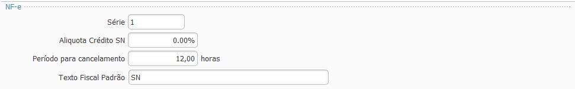

### Ajustes Fiscal - NFe

`Série` deve ser preenchido para as empresa emitentes de [NF-e](nfe.md).

`Alíquota Crédito SN` deve ser preenchido com a alíquota para as empresas do [SImples Nacional](simples_nacional.md) que permitem crédito de ICMS.

`Período para cancelamento` deve ser preenchido com o período que a empresa deseja permitir fazer o cancelamento de NF-e, deve ser igual ou menor ao período permitido pelo [SEFAZ](sefaz.md).

`Texto Fiscal Padrão` deve ser preenchido com algum [Texto fiscal](texto_fiscal.md), tipo [Fisco](texto_fiscal_fisco.md) que será impresso em todas as NF-e emitidas. Parâmetro não obrigatório.

[Voltar](ajustes_fiscal.md)

