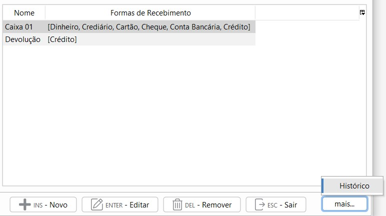

[Início](index.md) / [Caixa](caixa.md)/  Caixa

{: #pesquisa}

### Pesquisa de Caixa

Na tela de pesquisa de Caixas são listados todos os caixas cadastrados na empresa. Na grade é possível visualizar todas as formas de Recebimento disponíveis neste Caixa.

Através do botão `Mais`é possível acessar o histórico de todos os Caixas fechados de todos os operadores.

{: #historico}

Ao clicar em histórico será aberta uma lista com a relação de Caixas fechados e com um duplo click em cima pode-se consultar o histórico do Caixa.

{: #cadastro}

### Cadastro de Caixa

Ao clicar em Novo é possível cadastrar um novo caixa, o nome pode ser uma descrição que mais se adeque a sua empresa, pode ser o nome de um funcionário, um sequencial como Caixa 01, 02 ou por algum processo específico como Caixa Vendas, Caixa Devoluções, etc.

Nas Formas de recebimento devem ser selecionadas as formas de recebimento que o Caixa vai receber.

No campo Conta Contábil deve ser informada a conta Contábil de Caixa. No plano de contas padrão do sistema já existem três  contas Contábeis de Caixa: Caixa 01, Caixa 02 e Caixa 03 elas podem ser utilizadas com essa descrição ou podem ser renomeadas no [Plano de Contas](contabilidade.md#planocontas).

#### Regras de Fechamento

Aqui você pode configurar uma regra para que seu caixa seja fechado uma vez por semana, basta informar a quantidade de horas depois da abertura ou pode configurar para que seu caixa seja fechado diariamente até uma determinada hora. Desta maneira na tela de Operação de Caixa vai aparecer uma mensagem de alerta solicitando o fechamento do Caixa no momento indicado e não vai mais permitir realizar transações.

Este é um parâmetro não obrigatório, então se o Caixa não tem uma regra específica para fechamento, basta marcar o campo "Não aplicar regras para fechamento".

#### Limite de Dinheiro em Caixa

Este é outro parâmetro não obrigatório você pode aplicar uma regra e um valor de limite de dinheiro em Caixa. 

`Alerta`: na tela de Operação de Caixa vai aparecer um alerta informando que o Valor de Dinheiro em Caixa está excedido, porém vai permitir continuar as transações.

`Bloquear`: na tela de Operação de Caixa também vai aparecer um alerta informando que o Valor de Dinheiro em Caixa está excedido, só que neste caso não vai permitir continuar as transações.

[Voltar](caixa.md)