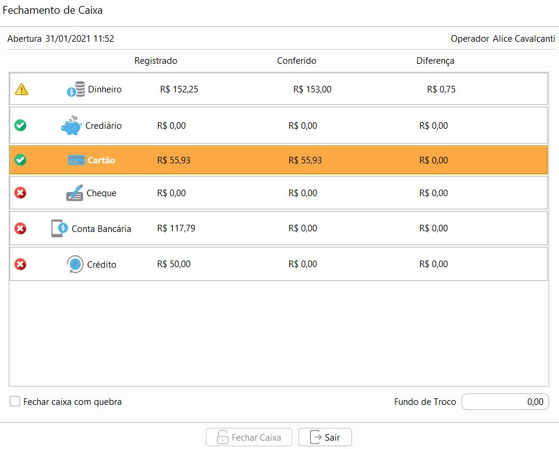

[Início](index.md) / [Caixa](caixa.md) /  Operação de Caixa

{: #listagem}

### Listagem de Caixa

Ao clicar em operação de Caixa, caso não haja caixa aberto para o seu usuário, irá abrir a listagem dos caixas.

Nos caixas já abertos por outros usuários, apenas a opção de [histórico](caixa_caixa.md#historico) fica disponível, onde neste caso será possível acessar somente os históricos dos seu usuário nos caixas. Para acessar o histórico de todos os usuários nos caixas deve-se acessar o cadastro do caixa.

Nos caixas fechados a opção abrir também fica disponível.

#### Abertura de Caixa

Ao clicar em abrir é realizada a abertura do caixa e a partir deste momento somente o seu usuário pode realizar transações neste caixa.

As operações de Faturamento de Venda e Recebimento de Contas a Receber, podem ser executadas tanto pela tela de  Operação de Caixa quanto por próprios menus de Venda e Contas a Receber, porém mesmo que não executadas na tela de operação de Caixa entram no resumo deste caixa aberto.

É permitido somente um caixa aberto por usuário.

{: #painel}

### Painel de Operações

Ao clicar em operação de Caixa, caso já exista um caixa aberto para o seu usuário, a tela de operação de caixa será aberta.

Na parte superior do caixa está o painel de operações, neste painel é possível realizar as seguintes operações do Caixa:

{: #faturamento}

#### Faturamento

A opção de faturamento fica habilitada quando selecionada alguma venda para faturamento no painel de faturamento. (abaixo do painel de operações).  O faturamento de Venda pode ser realizado por esse botão de faturamento na tela de Operação de Caixa, ou diretamente na Venda através do botão `Mais`. Para maior detalhamento veja em: [Faturamento de venda](vendas_venda.md#faturamento)

{: #contasreceber}

#### Contas a Receber

A opção de Contas a Receber abre a tela de contas a Receber. O recebimento de contas a Receber pode ser realizado por esse botão de Contas a Receber na tela de Operação de Caixa, ou diretamente no Contas a Receber no menu Financeiro. Para maior detalhamento veja em: [Contas a Receber](financeiro_contas_receber.md)

Nas opções de faturamento e contas a receber, estão disponíveis somente as formas de recebimento cadastradas no [caixa](caixa_caixa.md#cadastro).

{: #movimentacaomanual}

#### Movimentação Manual

Nesta podem ser inseridas todas as movimentações de entrada e saída de caixa que forem além das já feitas nos outros processos do sistema, como por exemplo uma saída por Sangria, um adiantamento feito à um fornecedor ou uma entrada para fundo de troco, um adiantamento recebido de cliente.

Os motivos devem ser previamente cadastrados no Cadastro de [Motivo de Movimentação Manual de Caixa](caixa_motivo_movimentacao_manual_caixa.md).

Alguns campos só aparecem de acordo com o motivo informado, por exemplo o campo Cliente ou Fornecedor só aparece se o motivo for parametrizado para [Gerar crédito para o cliente\fornecedor](caixa_motivo_movimentacao_manual_caixa.md#gerarcredito).

Os campos de Créditos em aberto só aparecem se o motivo for parametrizado para [Liquidar crédito para o cliente\fornecedor](caixa_motivo_movimentacao_manual_caixa.md#liquidarcredito).

Os créditos de cliente são gerados através de uma movimentação manual de Caixa ou Banco que gere crédito ou por uma devolução de Venda.

Os créditos de cliente são gerados através de uma movimentação manual de Caixa ou Banco que gere crédito ou por uma devolução de Compra

Os créditos de Cliente podem ser liquidados com o faturamento de uma Venda ou Recebimento de Contas a Receber, ou caso for pago em espécie através de uma movimentação manual de caixa, basta informar o valor no campo `Consumido.`

Os créditos de Fornecedor podem ser liquidados com o faturamento de uma Compra ou Pagamento de Contas a Pagar, ou caso for recebido em espécie através de uma movimentação manual de caixa, basta informar o valor no campo `Consumido.`

{: #resumo}

#### Resumo

O resumo do caixa é uma tela para visualizações resumida das transações feitas pelo Caixa e também dos Saldos por forma de recebimento.

No agrupamento de ENTRADAS estão resumidas as entradas em caixa por operação. Para as Vendas e Contas Recebidas são consideradas apenas as transações que não foram canceladas ou estornadas.

Em RETIRADAS está resumindo apenas os valores de retirada em dinheiro de caixa feitas por Movimentação Manual.

No agrupamento de Outras Movimentações estão resumidas as outras operações de saída, que são as Vendas que foram canceladas, as Contas Recebidas que foram estornadas e as Devoluções de Vendas.

No agrupamento de Saldo de fechamento estão os saldos por forma de recebimento, esses serão os montantes exibidos no fechamento do Caixa. O Total de Entradas menos (-) as Retiradas deve ser igual ao Saldo de Fechamento.

{: #fechamentocaixa}

#### Fechamento de Caixa

O processo de fechamento de caixa é obrigatório para fechar o caixa.  

Cada forma de pagamento deve ser conferida, mesmo que o valor seja zerado. 

Para realizar a conferência basta clicar em cima da forma de pagamento e uma janela com as transações será exibida e então basta clicar em conferir. 

`Dinheiro` O valor pode ser informado por Nota e Moeda ou por Valor Total

`Crediário` É  um informativo das Vendas e Contas Recebidas como crediário.

`Cartão` É  um informativo das Vendas e Contas Recebidas no Cartão. Caso seja necessário pode ser incluso ou alterado o comprovante da transação efetuada no cartão.

`Cheque` É  um informativo das Vendas e Contas Recebidas no Cheque. Caso seja necessário pode ser incluso ou alterado o número e emitente do cheque.

`Conta Bancária` É  um informativo das Vendas e Contas Recebidas com depósito bancário.

`Credito` É  um informativo das Vendas e do Contas a receber que foram liquidados contra um crédito de Cliente.

Após a conferência, a forma de pagamento fica com ícone de verificado, caso haja diferença fica com  ícone de alerta. 

Caso haja diferença na conferência do dinheiro o caixa, o botão Fechar Caixa só ficará habilitado se a opção `Fechar caixa com quebra` estiver marcado. 

Se o caixa for fechado com diferença na conferência em dinheiro, o valor da diferença será contabilizada na conta contábil de [Quebra de caixa](contabilidade_parametro_contabil.md#caixa).

O valor conferido em dinheiro será contabilizado na conta de [Fechamento de Caixa](contabilidade_parametro_contabil.md#caixa).

O campo Fundo de Troco só é habilitado caso o parâmetro [Habilita fundo de troco](sistema_parametrizacao.md#caixa)  for marcado. Se for informado valor no campo Fundo de Troco, esse valor será descontado do valor em dinheiro no fechamento de caixa e ficará disponível como saldo inicial na próxima abertura.

Após  o fechamento de caixa, um comprovante de Conferência de Caixa é impresso automaticamente . Essa conferência pode ser impressa também através da consulta de histórico de caixa.

{: #abafaturamento}

### Faturamento

Na aba de Faturamento estão listadas todas as vendas disponíveis para faturamento,  no painel direito está o detalhamento da operação com detalhes do cliente e dos produtos.

Para executar o faturamento da venda basta selecionar a linha e clicar no botão Faturamento no painel de Operações.

O faturamento de Venda pode ser realizado aqui pelo caixa, ou diretamente na Venda através do botão `Mais`. Para maior detalhamento sobre faturamento de venda veja em: [Faturamento de venda](vendas_venda.md#faturamento)

{: #abatransacoes}

### Transações

Na aba de Transações estão listadas todas as operações que o caixa realizou, no painel direito está o detalhamento da operação. As linhas ~~riscadas~~ são referentes à operações canceladas.

{: #graficos}

### Gráficos

No lado esquerdo é apresentado com um gráfico que representa as retiradas de dinheiro por movimentação manual em Laranja e em Azul as entradas de caixa por vendas, Contas a Receber e Movimentação Manual .

Do lado direito é apresentado um outro gráfico que representa a quantidade de dinheiro em caixa. Se no cadastro do caixa for informado um valor limite de dinheiro em caixa, será indicado neste gráfico.

[Voltar](caixa.md)

