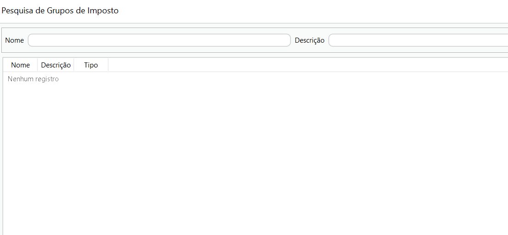

[Início](index.md) / Como alterar o CSOSN

### Como alterar o CSOSN do ICMS

Você pode alterar os valores de impostos e CSOSN em cada venda, mas o ideal é deixar a configuração correta em cada grupo de imposto, que será amarrado ao cadastro do produto.

Os dois grupos de impostos abaixo são padrão do sistema e já vem cadastrados quando você instala o Continente Nuvem. 

Se sua empresa está no regime do Simples Nacional e seus produtos estão enquadrados na situação tributária "*103	Isenção do ICMS no Simples para receita bruta"* você não precisa alterá-los e pode utilizá-los no [cadastro de produtos](como_fazer_cadastrar_produto.md).

Se seus produtos estão enquadrados em outra situação tributária veja abaixo como alterar o CSOSN do ICMS:

Clique em Gestão Fiscal>> Grupo de impostos, selecione o grupo de impostos que quer alterar e de um duplo click ou clique em editar.

Renomeie o Nome e descrição do grupo de acordo com as alterações que você vai fazer.

Clique na linha do imposto ICMS e clique em editar. 

Altere o CSOSN conforme necessário e clique em atualizar.

Clique em gravar.

Se sua empresa tem mercadorias enquadradas em mais de uma situação tributária crie mais grupos de impostos e os configure em cada produto.

[Voltar](index.md)

