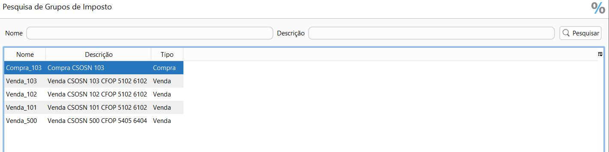

[Início](index.md) / Como alterar Grupo de Imposto de Venda

### Como alterar um Grupo de Imposto de Venda

Os valores de impostos e CSOSN podem ser [redefinidos](vendas_venda.md#redefinirimpostos) em cada venda, mas o ideal é deixar a configuração correta em cada grupo de imposto, que será amarrado ao cadastro do produto.

Alguns grupos de impostos já vem cadastrados quando você instala o Continente Nuvem. Você pode utilizar estes na parametrização dos seu produtos, ou pode criar novos ou alterá-los.

Clique em Gestão Fiscal>> Grupo de impostos, selecione o grupo de impostos que quer alterar e de um duplo click ou clique em editar.

Renomeie o Nome e descrição do grupo de acordo com as alterações que você vai fazer.

Clique na linha do imposto ICMS e clique em editar. 

Altere o CSOSN conforme necessário e clique em atualizar.

Clique em gravar.

[Clique aqui](gestao_fiscal_grupo_imposto.md) e saiba mais sobre os grupos de impostos.

[Voltar](index.md)

