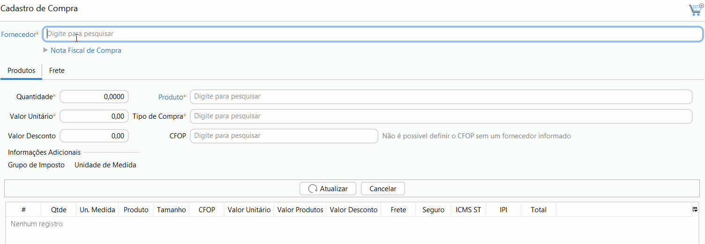

[Início](index.md) / Como cadastrar uma compra

### Como cadastrar uma compra?

Acesse Menu: Compras>>compra e clique em novo.

Informe o fornecedor, você pode buscar por qualquer parte do nome do fornecedor. Se o fornecedor não estiver cadastrado basta clicar em Fornecedor e cadastrar.

Clique em Nota Fiscal de Compra para informar os dados da Nota Fiscal. Ao informar a chave de acesso o sistema preenche automaticamente o número e série da Nota Fiscal. Os dados da Nota Fiscal não são obrigatórios no cadastro da compra, eles podem ser informados também no momento do faturamento da compra.

Informe a quantidade e o produto. O produto pode ser inserido através do código de barras.

Se houver valor de frete ou seguro, informe-os na aba Frete. Se a transportadora não estiver cadastrada, clique em Transportadora para cadastrar.

O Valor de frete e seguro serão rateados proporcionalmente e vão compor o custo de cada produto.

Clique em gravar e pronto, sua compra está pronta para ser faturada, [clique aqui](como_fazer_como_faturar_compra.md) para saber como.

Para mais informações sobre todos os campos do cadastro de compra [clique aqui](compras_compra.md).

[Voltar](index.md)

