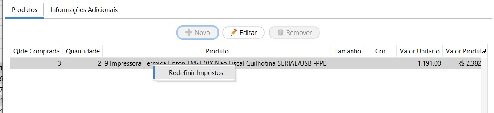
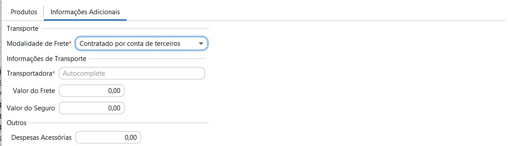
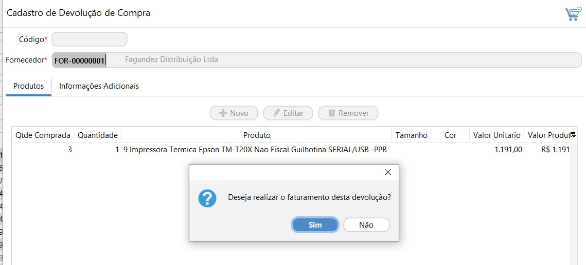

[Início](index.md) / Como cadastrar uma devolução de compra

### Como cadastrar uma devolução de Compra?

Acesse Menu: Compras>> Devolução de compra e clique em `Novo`.

Adicione o fornecedor e em `Novo` para incluir os produtos.

O CFOP é preenchido automaticamente através do grupo de impostos amarrado ao item, podendo ser alterado.

Se o recurso de Compras estiver habilitado a devolução de compra pode ser cadastrada através da compra, neste caso ao abrir a devolução de compra a partir de uma compra o sistema já traz automaticamente preenchido o fornecedor e os produtos da compra, sendo necessário apenas indicar a quantidade que será devolvida nos itens que serão devolvidos.

#### Redefinir Impostos

Os impostos na Devolução de Compra são os mesmos impostos calculados na compra, são os impostos que estão parametrizados no Grupo de Imposto de compra amarrado ao produto.  O CST e CFOP são próprios para a devolução parametrizados no Grupo de Imposto de compra.

Caso necessário os impostos podem ser revisados, clicando com o botão inverso do mouse em cima da linha, em Redefinir Impostos.

É possível alterar o grupo de impostos, e assim o sistema faz todo o recálculo dos impostos de acordo com o impostos do novo grupo selecionado:

Ou pode-se alterar diretamente o valor do Imposto, base ou CST calculados, para isso o campo "Informar Manualmente" deve ser marcado, assim todos os campos permitem edição.

#### Informações Adicionais

##### Transporte

Na aba Transporte devem ser inseridos os valores de Frete e Seguro que compõe o valor total da Nota Fiscal. 

##### Outros

O valor de  Despesas acessórias informado neste campo será impresso em campo próprio no DANFE e irá compor o Valor Total da Nota Fiscal. Neste campo podem ser informados os valores de ICMS-ST ou IPI ou qualquer outra despesa que compõe o valor da NF-e 

Ao clicar no botão Gravar a Devolução de Venda poderá ser faturada no mesmo momento ou então será salva com status aberto na pesquisas da Devolução de Compra.

[Clique aqui](como_fazer_faturar_devolucao_compra.md) para saber aprender como fazer o faturamento da devolução compra.

Para mais informações sobre todos os campos do cadastro de Devolução de compra [clique aqui](compras_devolucao_compra.md).

[Voltar](index.md)

