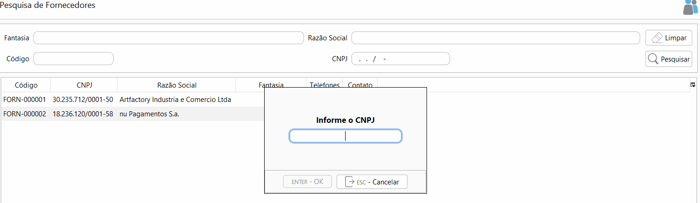

[Início](index.md) / Como cadastrar um fornecedor

### Como cadastrar um Fornecedor?

Acesse Menu: Compras>>Fornecedor e clique em novo.

Informe o CNPJ e clique OK.

O código do fornecedor será preenchido automaticamente de acordo com a [sequencia numérica](sistema_sequencia_numerica.md) podendo ser alterada ou substituída por outro código, para isto basta remover a sequencia numérica de fornecedor.

Clique em Consultar CNPJ e depois selecione "Atualizar Todos" e clique em Atualizar.

Informe a Inscrição Estadual se houver e marque o campo Contribuinte de ICMS se for o caso.

*os dados são consultados na base de dados da Receita Federal do Brasil e podem ter uma atualização de até 3 meses antes.

Clique em gravar.

Para mais informações sobre todos os campos do cadastro de fornecedor [clique aqui](compras_fornecedor.md).

[Voltar](index.md)

