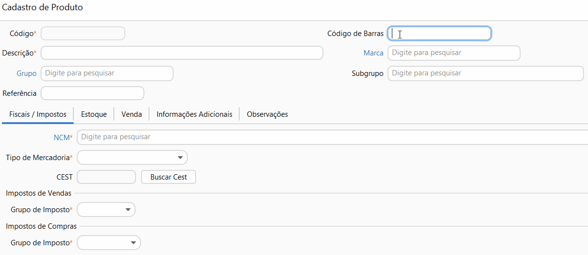

[Início](index.md) / Como cadastrar um produto

### Como cadastrar um produto?

Acesse Menu: Estoque>>Produto e clique em novo.

O código do produto será preenchido automaticamente de acordo com a [sequencia numérica](sistema_sequencia_numerica.md), caso queira preencher o código com outra numeração basta remover a sequencia numérica de produto.

O código de barras  não é obrigatório, mas irá ajudar a cadastrar suas vendas de maneira ágil.

Informe a descrição e  também as informações de [Marca](estoque_marca.md#marca) e [Grupo](estoque_grupo_subgrupo.md#grupoproduto) e subgrupo se houverem.

Informe a NCM, você pode buscar por uma descrição parcial da NCM.

Informe o Grupo de Impostos de Compra e Venda. Os grupos de impostos padrão do sistema tem CSOSN 103. Se seus produtos estão enquadrados em outra situação tributária [clique aqui](como_fazer_alterar_CSOSN_ICMS.md) para ver como alterá-los.

Na aba estoque, se houver, informe as [dimensões de estoque](sistema_parametrizacao.md#dimensaoestoque) que o produto será controlado, como tamanho ou cor. Após a gravação do item essa informação não poderá mais ser alterada.

Na Aba venda informe o preço de venda, ou a margem que deve ser acrescida em cima do custo para formar o preço de venda. 

Clique em gravar.

Para mais informações sobre todos os campos do cadastro de produto  [clique aqui](estoque_produto.md).

[Voltar](index.md)

