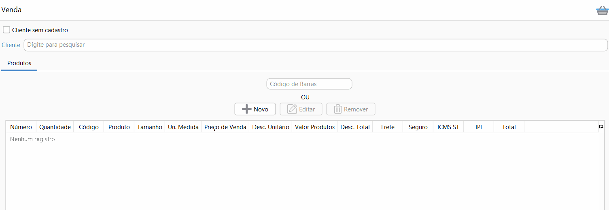

[Início](index.md) / Como cadastrar uma Venda

### Como cadastrar uma Venda?

Acesse Menu: Vendas>>venda e clique em novo.

Se não houver cliente cadastrado e o cliente não quiser fazer o cadastro,  deve-se marcar a opção Cliente sem cadastro e no campo Cliente pode se informar o nome ou alguma outra identificação para o cliente.

Se o cliente quiser fazer o cadastro basta clicar em cima do Cliente e realizar o cadastro.

Se já houver cadastro do cliente basta buscar no campo cliente por qualquer parte do nome ou sobrenome.

Os produtos podem ser inclusos através da leitura de código de barras, se a quantidade for maior que 1, basta informar a quantidade e * antes do código de barras:

Os produtos podem ser inclusos também através da busca manual dos produtos:

Depois de informar os produtos é só clicar em gravar e pronto, sua venda está cadastrada!

Para mais informações sobre todos os campos do cadastro de venda [clique aqui](vendas_venda.md).

[Voltar](index.md)

