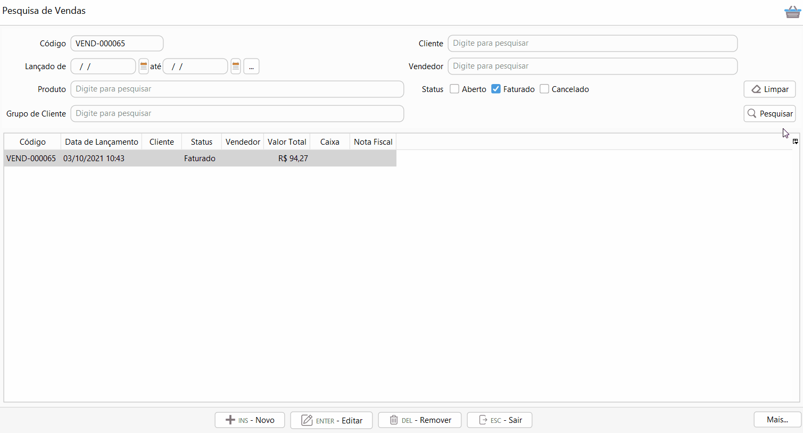

[Início](index.md) / Como emitir NFC-e de venda de mercadoria?

### Como emitir NCF-e de venda de mercadoria?

Nos parâmetros do sistema é parametrizado um modelo de documento fiscal padrão a ser emitido, essa informação pode também ser parametrizada por cliente. No cadastro da venda é  definido qual será o modelo de documento fiscal emitido, que pode ser NF-e (Nota fiscal eletrônica) ou NFC-e (Nota fiscal do consumidor eletrônica).

A NF-e pode ser emitida automaticamente no faturamento da venda, ou poder ser emitida após o faturamento, para isso acesse o menu Vendas, pesquise a venda já faturada e clique no menu `Mais`>>Emitir DF-e.

Na aba Pagamento as formas de recebimento vem preenchidas conforme informado no faturamento e não podem ser alteradas. 

O CPF pode ser inserido para informação na NFC-e.

Agora é só clicar em `Emitir` e pronto a NFC-e será emitida e enviada para o SEFAZ. Todas as Notas fiscais emitidas podem ser consultadas na tela de [Gestão de DF-e](gestao_fiscal_gestao_dfe.md).

[Voltar](index.md)

