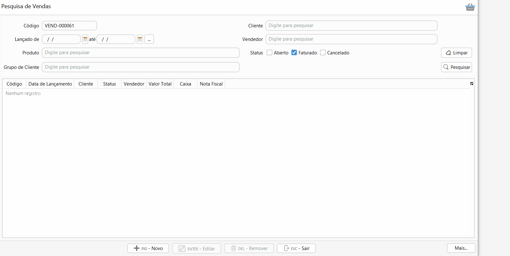

[Início](index.md) / Como emitir NF-e de venda de mercadoria?

### Como emitir NF-e de venda de mercadoria?

Nos parâmetros do sistema é parametrizado um modelo de documento fiscal padrão a ser emitido, essa informação pode também ser parametrizada por cliente. No cadastro da venda é  definido qual será o modelo de documento fiscal emitido, que pode ser NF-e (Nota fiscal eletrônica) ou NFC-e (Nota fiscal do consumidor eletrônica).

A NF-e pode ser emitida automaticamente no faturamento da venda, ou poder ser emitida após o faturamento, para isso acesse o menu Vendas, pesquise a venda já faturada e clique no menu `Mais`>>Emitir DF-e.

Na aba Pagamento as formas de recebimento vem preenchidas conforme informado no faturamento e não podem ser alteradas. 

A aba Produtos mostra um detalhamento dos produtos e impostos. Os impostos não são inclusos ou alterados neste momento, eles devem ser alterados na criação da venda. Nesta aba podem ser inclusos os textos como segunda linha da NF-e, basta clicar com o botão inverso do mouse em cima da linha.

Na  aba Transporte podem ser complementadas as informações do transporte de mercadoria.

Na aba Informações Adicionais  são adicionados os textos que serão impressos no rodapé da NF-e. Alguns textos são preenchidos automaticamente de acordo com o definido nos [parâmetros do sistema.](sistema_parametrizacao.md) 

Agora é só clicar em `Emitir` e pronto a NF-e será emitida e enviada para o SEFAZ. Todas as Notas fiscais emitidas podem ser consultadas na tela de [Gestão de DF-e](gestao_fiscal_gestao_dfe.md).

A NF-e aprovada é enviada automaticamente para o e-mail parametrizado no [cadastro do cliente](vendas_cliente.md).

[Voltar](index.md)

