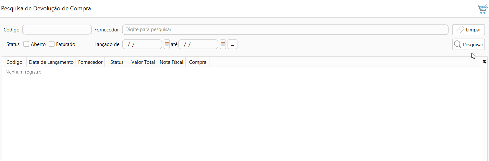

[Início](index.md) / Como faturar uma devolução de compra

### Como faturar uma devolução de Compra?

Acesse Menu: Compras>>Devolução de compra, pesquise a devolução de compra que você quer faturar.

Selecione a devolução de compra e clique no menu `Mais`>>Faturamento ou digite F2.

Na aba informações Adicionais devem ser informadas as informações de volume da mercadoria, caso houver frete destacado na Devolução de Compra.

Na aba informações Adicionais também são adicionados os textos que serão impressos no rodapé do DANFE. [Clique aqui](compras_devolucao_compra.md#textos) e entenda a diferença entre informações adicionais e informações fiscais.

Na aba Referência fiscal deve ser informada a chave de acesso da NF-e de compra, caso a devolução tenha sido criada a partir de uma compra essa informação já estará preenchida.

Agora é só clicar em faturar e pronto a sua devolução de compra será faturada. O  estoque será registrado com a saída da mercadoria e a a NF-e de devolução será emitida.

Se os recursos financeiros estiverem habilitados será gerado um crédito para o fornecedor que poderá ser pago ou abatido em outra compra.

Para mais informações sobre o faturamento de devolução de compra [clique aqui](compras_devolucao_compra.md#faturamento).

[Voltar](index.md)

