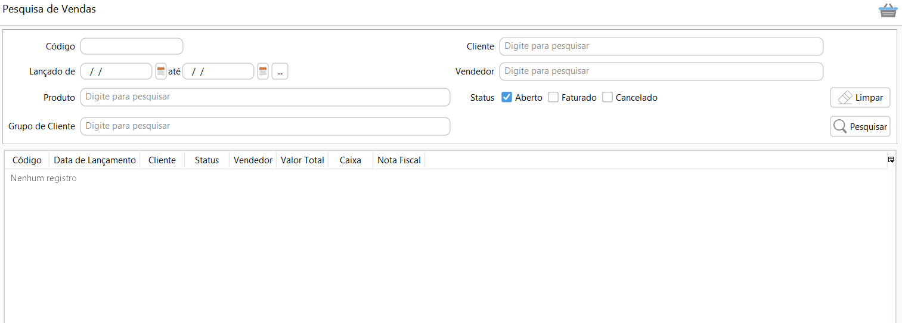

[Início](index.md) / Como cadastrar uma devolução de venda

### Como faturar uma devolução de Venda?

Acesse Menu: Vendas>>venda, pesquise a venda que você quer devolver.

Selecione a venda e clique no menu `Mais`>>Devolução ou digite Ctrl + D.

Selecione a linha que será devolvida, clique em `editar` e informe a quantidade que será devolvida.

Se for uma devolução total clique em `Devolver Tudo.`

Se na venda não houve informação de cliente cadastrado, essa informação pode e deve ser informada diretamente na devolução de venda pois é fundamental para emissão da NF-e.

Depois de informar a quantidade de produtos é só clicar em gravar e pronto, sua devolução de venda está pronta para ser faturada!

[Clique aqui](como_fazer_faturar_devolucao_venda.md) para saber aprender como fazer o faturamento da devolução venda.

Se a venda de origem não tiver sido faturada no Continente Nuvem, você pode fazer a devolução diretamente no menu Vendas>Devolução de venda, neste caso os produtos terão que ser inclusos manualmente.

Para mais informações sobre todos os campos do cadastro de Devolução de venda [clique aqui](vendas_devolucao_venda.md).

[Voltar](index.md)

