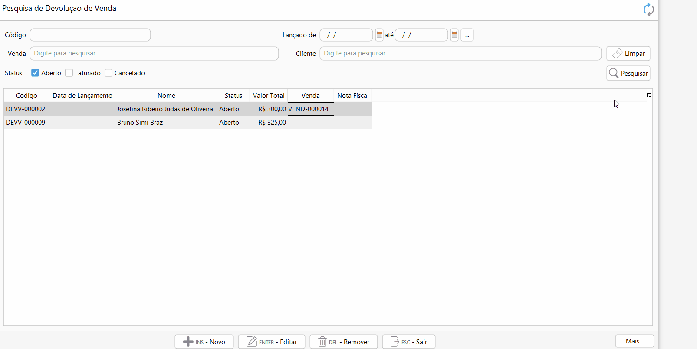

[Início](index.md) / Como cadastrar uma devolução de venda

### Como faturar uma devolução de Venda?

Ao gravar a devolução de venda o sistema pergunta se deseja prosseguir com o faturamento, ou acesse Menu: Vendas>>Devolução de venda, pesquise a devolução de venda que você quer faturar.

Selecione a devolução de venda e clique no menu `Mais`>>Faturamento ou digite F2.

Por padrão a opção "Emitir NF-e de Devolução" estará marcada, nos casos onde o cliente emite a NF-e de devolução essa opção deverá ser desmarcada e deve ser informado os dados da NF-e do Cliente.

Caso houver frete destacado na Devolução de Venda devem ser inseridas as informações relacionadas ao Volume da Mercadoria na aba Transporte.

Na aba informações Adicionais podem ser adicionados os textos que serão impressos no rodapé do DANFE. [Clique aqui](vendas_devolucao_venda.md#informacoesadicionais) e entenda a diferença entre informações adicionais e informações fiscais.

Na aba Referência fiscal está informada os dados da Venda que originou a devolução, se a devolução de venda foi criada manualmente as informações de referência fiscal devem ser informadas manualmente.

Agora é só clicar em faturar e pronto a sua devolução de venda será faturada. O  estoque será registrado com a entrada da mercadoria e se a opção Emitir NF-e estiver marcada a NF-e de devolução será emitida.

Se o recurso de crédito de cliente estiver habilitado será gerado um crédito para o cliente que poderá ser pago ou abatido em outra venda.

Para mais informações sobre o faturamento de devolução de venda [clique aqui](vendas_devolucao_venda.md#faturamento).

[Voltar](index.md)

