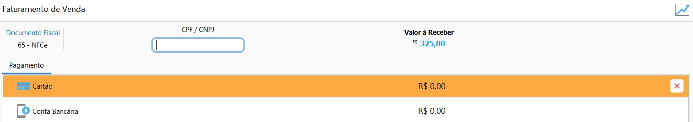

### Como faturar uma Venda?

Acesse Menu: Vendas>>venda, selecione uma venda, clique em Mais e Faturamento

Todo faturamento é associado há um documento fiscal, que pode ser uma NF-e ou uma NFC-e.

Para NFC-e existe a possibilidade de informar o CPF\CNPJ na NFC-e, caso haja um cliente cadastrado essa informação vem preenchida podendo ser removida.

O valor de acordo com a forma de recebimento, podendo ser informada uma ou mais formas de recebimento.

Caso o faturamento for associada a uma NF-e, as abas Produtos, Transporte e informações adicionais também ficam disponíveis.