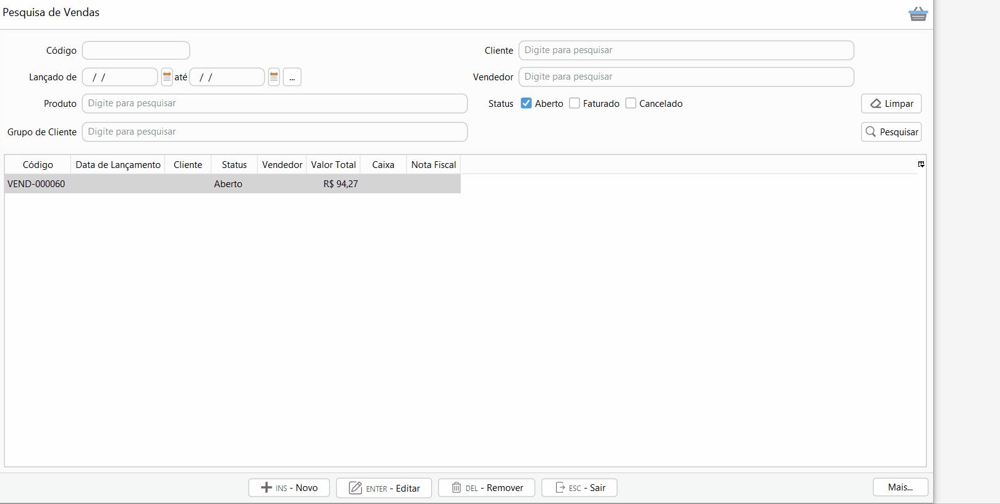

### Como faturar uma Venda?

Acesse Menu: Vendas>>venda, pesquise a venda que você quer faturar.

Selecione a venda e clique no menu `Mais`>>Faturamento ou digite F2.

Devem ser informado os valores por forma de recebimento, podendo ser informada uma ou mais formas de recebimento.

Agora é só clicar em faturar e pronto a sua venda será faturada. O  estoque será registrado com a saída da mercadoria e o documento fiscal poderá ser emitido automaticamente em seguida.

Quando o documento fiscal emitido for NFC-e existe a possibilidade de informar o CPF\CNPJ.

Para NF-e, as abas Produtos, Transporte e informações adicionais também ficam disponíveis.

Caso houver frete destacado na Venda devem ser inseridas as informações relacionadas ao Volume da Mercadoria na aba Transporte.

Na aba informações Adicionais podem ser adicionados os textos que serão impressos no rodapé do DANFE. [Clique aqui](vendas_venda.md#informacoesadicionais) e entenda a diferença entre informações adicionais e informações fiscais.

Se os recursos financeiros estiverem habilitados as transações financeiras também serão geradas nesse momento, podendo ser de contas a receber no caso de recebimento à prazo ou de entrada no caixa ou banco nas transações à vista.

Para mais informações sobre o faturamento de venda [clique aqui](vendas_venda.md#faturamento).

[Voltar](index.md)

