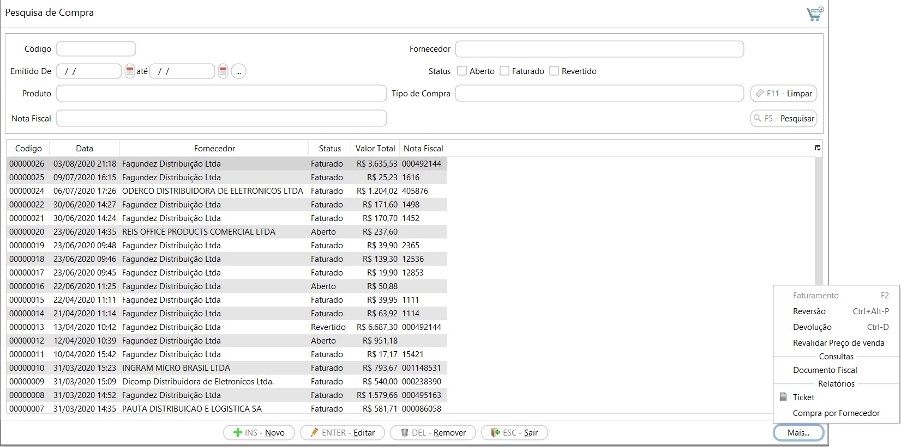

{: #compra}

### Compra

{: #pesquisa}

#### Pesquisa

Nesta tela estão disponíveis todas as compras cadastradas, as faturadas e as em aberto.

Através do botão mais pode-se acessar os menus relacionados com a compra. 

A opção Faturamento só fica disponível para as Compras com status Aberto.

As opções Reversão e Devolução só ficam disponíveis para as Compras com status Faturado.

####  

#### Ticket

O ticket de compra pode ser impresso para compras Faturadas e Abertas. Para as compras em aberto não imprime as condições de pagamento.

{: #cadastro}

#### Cadastro

*Fornecedor*:  A busca pode ser feita tanto pelo código, digitando-o apenas parcialmente ou pela nome, também digitando-o apenas parcialmente.

*Nota Fiscal de Compra*: Essas informações não são obrigatórias no cadastro da compra. Elas podem ser inseridas nesse formulário ou na tela de  Faturamento. Se preenchido no formulário de compra, os dados serão levados para a tela de faturamento. Essas informações são obrigatórias para o faturamento da Compra. Ao informar a chave de acesso os campos de Modelo, Número e Série serão preenchidos automaticamente. A data de Emissão é a data que o fornecedor emitiu a Nota fiscal e a data de Lançamento é a data que será feita a entrada da mercadoria bem como a contabilização da compra.

*Produtos:*

Ao clicar e Novo os campos para adição do produto ficam disponíveis.

Quantidade: Campo informado manualmente. Quantidade de produto que entrará no estoque.        

Produto: Campo informado manualmente.. O campo produto pode ser pesquisado tanto pelo código quanto a descrição do produto.

Caso o produto esteja parametrizado para utilizar dimensão de estoque, os campos ficam disponíveis após o produto. No exemplo abaixo a dimensão de estoque é o Tamanho.

Valor Unitário: Campo informado manualmente. Valor unitário do produto. Os valores de frete e impostos (ICMS-ST e IPI) também irão somar ao custo do produto.

CFOP: Campo preenchido automaticamente através do grupo de Impostos de compra amarrado ao produto, mas pode ser editado manualmente.

*Informações Adicionais:*

O grupo de impostos e Unidade de medida do produto são visualizados nas Informações adicionais. O grupo de impostos pode ser alterado em [Redefinir impostos](compras_compra.md#redefinirimpostos).

Ao clicar em atualizar os dados são atualizados na grade e um novo produto pode ser inserido.

Na grade já é possível visualizar os impostos, IPI e ICMS-ST que foram calculados e o valor do custo total.

{: #redefinirimpostos}

##### Redefinir Impostos

Os impostos de compra são calculados automaticamente através do [Grupos de Impostos de Compra](estoque_produto.md#grupoimpostoscompra) parametrizado no cadastro do produto.  Para editar-os deve clicar com o botão inverso do mouse em cima da linha na grade.

Ao abrir a tela de redefinir impostos, ficam disponíveis o detalhamento dos impostos que foram calculados.

Pode-se alterar o grupo de impostos e sistema fará o recálculo dos impostos de acordo com o novo grupo:

Ou pode-se alterar diretamente o valor do Imposto, Base, CST calculados, para isso o campo "Informar Manualmente" deve ser marcado, assim todos os campos permitem edição.

Ao alterar os impostos manualmente o sistema não faz nenhum novo cálculo, por exemplo se for alterado a base de cálculo o sistema não recalcula o valor do imposto. 

{: #frete}

##### Frete

Na aba Frete devem ser inseridos os valores de Frete e Seguro que compõe o valor total da Nota Fiscal. Esses valores são rateados por produtos e fazem parte do custo da mercadoria. 

Ao clicar no botão Gravar a Compra é salva e pode ser editada em outro momento ou faturada.

[Voltar](compras.md#compras)