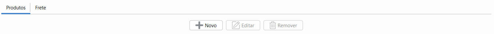
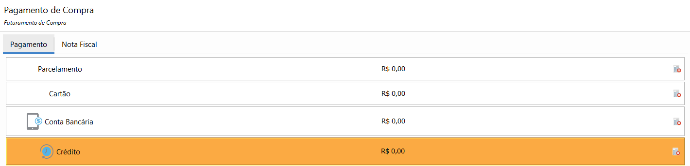
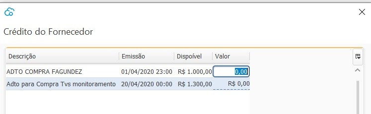
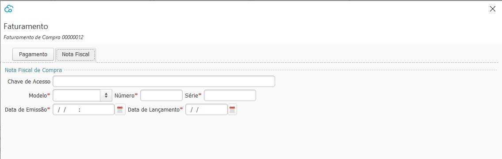
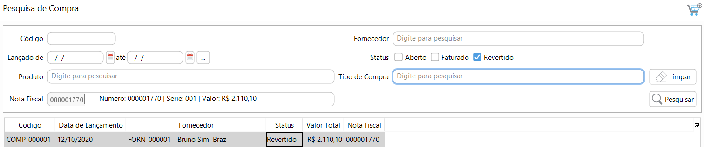
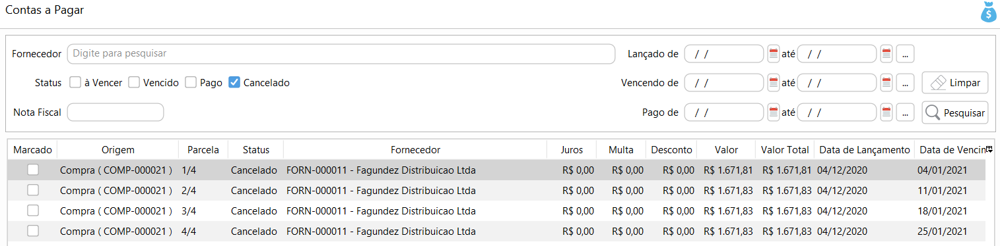
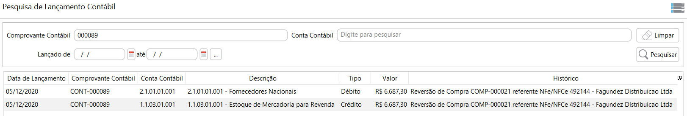
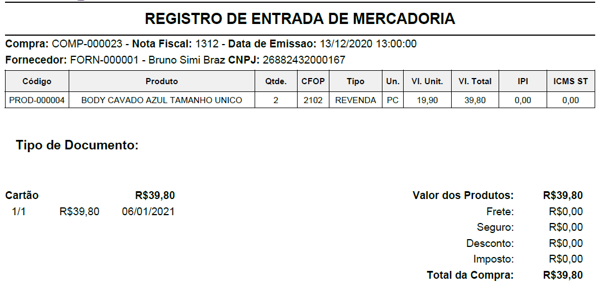

[Início](index.md) / [Compras](compras.md) / Compra

{: #compra}

###  Compra

{: #pesquisa}

### Pesquisa de Compra

Nesta tela estão disponíveis todas as compras cadastradas, faturadas e as em aberto. 

#### Status

- Aberto- Compras já iniciadas mas não faturadas. Permitem edição.
- Faturado - Compras já faturadas. Não permitem edição.
- Revertido - Compras já faturadas e que foram estornadas. Não permitem edição.

### Processos

Através do botão `Mais` ou com o botão inverso do mouse se acessa todos os processos relacionados a Compra e também a impressão dos Tickets e relatórios.

O menu [Devolução](compras_devolucao_compra.md#devolucaocompra) é habilitado somente se selecionado uma Compra com status Faturado.

O menu [Reversão](compras_compra.md#reversao) é habilitado somente se selecionado uma Compra com status Faturado.

O menu [Faturamento](vendas_venda.md#faturamento) é habilitado somente se selecionado uma Compra com status Aberto.

{: #cadastro}

#### Cadastro de Compra

*Fornecedor*:  A busca pode ser feita tanto pelo código, digitando-o apenas parcialmente ou pela nome, também digitando-o apenas parcialmente.

*Nota Fiscal de Compra*: Essas informações não são obrigatórias no cadastro da compra. Elas podem ser inseridas nesse formulário ou na tela de  Faturamento. Se preenchido no formulário de compra, os dados serão levados para a tela de faturamento. Essas informações são obrigatórias para o faturamento da Compra. Ao informar a chave de acesso os campos de Modelo, Número e Série são preenchidos automaticamente. A data de Emissão é a data que o fornecedor emitiu a Nota fiscal e a data de Lançamento é a data que é feita a entrada da mercadoria bem como a contabilização da compra.

*Produtos:*

Ao clicar em Novo os campos para adição do produto ficam disponíveis.

Quantidade: Campo informado manualmente. Quantidade de produto que entrará no estoque.        

Produto: Campo informado manualmente. O campo produto pode ser pesquisado tanto pelo código quanto a descrição do produto.

Caso o produto esteja parametrizado para utilizar dimensão de estoque, os campos ficam disponíveis após o produto. No exemplo abaixo a dimensão de estoque é o Tamanho.

Valor Unitário: Campo informado manualmente. Valor unitário do produto. Os valores de frete e impostos (ICMS-ST e IPI) também somam ao custo do produto.

CFOP: Campo preenchido automaticamente através do grupo de Impostos de compra amarrado ao produto, mas pode ser editado manualmente.

*Informações Adicionais:*

O grupo de impostos e Unidade de medida do produto são visualizados nas Informações adicionais. O grupo de impostos pode ser alterado em [Redefinir impostos](compras_compra.md#redefinirimpostos).

Ao clicar em atualizar os dados são atualizados na grade e um novo produto pode ser inserido.

Na grade já é possível visualizar os impostos, IPI e ICMS-ST que foram calculados e o valor do custo total.

{: #redefinirimpostos}

##### Redefinir Impostos

Os impostos de compra são calculados automaticamente através do [Grupos de Impostos de Compra](estoque_produto.md#fiscaisimpostos) parametrizado no cadastro do produto.  Para editar-os deve clicar com o botão inverso do mouse em cima da linha na grade.

Ao abrir a tela de redefinir impostos, ficam disponíveis o detalhamento dos impostos que foram calculados.

É possível alterar o grupo de impostos, e assim o sistema faz o recálculo dos impostos de acordo com o impostos do novo grupo selecionado:

Ou pode-se alterar diretamente o valor do Imposto, Base, CST calculados, para isso o campo "Informar Manualmente" deve ser marcado, assim todos os campos permitem edição.

Ao alterar os impostos manualmente o sistema não faz nenhum novo cálculo, por exemplo se for alterado a base de cálculo o sistema não recalcula o valor do imposto. 

{: #frete}

##### Frete

Na aba Frete devem ser inseridos os valores de Frete e Seguro que compõe o valor total da Nota Fiscal. Esses valores são rateados por produtos e fazem parte do custo da mercadoria. 

Ao clicar no botão Gravar a Compra é salva e pode ser editada em outro momento ou faturada.

{: #faturamento}

#### Faturamento

Nesta tela é feito o faturamento da compra, ou seja, após o faturamento o produto entra no estoque e o financeiro e o contábil também são efetuados, todos as transações são feitas na data de Lançamento informada na aba [Nota Fiscal](compras_compra.md#notafiscal).

Os valores informados são sumarizados nos totalizadores no final da tela.  Os valores informados podem ser removidos através do botão Remover no final de cada condição de pagamento.

*Dinheiro:* Esta forma de pagamento só fica disponível se houver um Caixa aberto para o usuário que está fazendo o pagamento e se no cadastro do caixa estiver parametrizado para fazer pagamento em Dinheiro.

*Parcelamento*:  O valor faturado como parcelamento será levado para o [Contas a Pagar](financeiro_contas_pagar.md#contaspagar).

*Cartão:* O valor faturado como Cartão de Débito será lançado como uma saída diretamente na conta bancária amarrada ao [cadastro de cartão corporativo](financeiro_cartao_corporativo.md#cadastro).

​             O valor faturado como Cartão de Crédito será lançado como transações na [conciliação de Cartão Corporativo](financeiro_cartao_corporativo.md#conciliacao).

*Depósito:* O valor faturado como depósito será lançado como uma saída diretamente na conta bancária informada.

*Crédito:* Somente poderá ser faturado como crédito, se houver crédito disponível para o Fornecedor. Neste caso o faturamento faz o abatimento do crédito.

Após o faturamento o histórico de abatimentos e saldo de crédito para o fornecedor pode ser visto diretamente no [menu crédito no cadastro do fornecedor](compras_fornecedor.md#credito).

{: #notafiscal}

#### Nota Fiscal

Essas informações são obrigatórias para o faturamento da Compra. Ao informar a chave de acesso os campos de Modelo, Número e Série serão preenchidos automaticamente. A data de Emissão é a data que o fornecedor emitiu a Nota fiscal e a data de Lançamento é a data que será feita a entrada da mercadoria bem como a contabilização da compra.

{: #reversao}

#### Reversão de Compra

Nesta tela  é possível fazer a reversão do lançamento de uma compra. Importante ressaltar que não é o cancelamento da Nota Fiscal, até porque a Nota Fiscal foi emitida pelo fornecedor e cabe ao mesmo o cancelamento se necessário.  Esse processo faz a reversão do lançamento da compra no sistema.

Deve-se informar o motivo da reversão e clicar em efetuar.

Ao efetuar a reversão da Compra o status da Compra e da Nota Fiscal no Gestão de NF-e ficam Revertido:

O financeiro gerado pela compra, por exemplo Contas à Pagar, transação de cartão corporativo ou transação bancária ficam com  status Cancelado:

 Na contabilidade é feito um lançamento contábil inverso ao feito na compra com o Histórico de Reversão:

#### Ticket

O ticket de compra pode ser impresso para compras Faturadas.

[Voltar](compras.md)