[Início](index.md) / [Compras](compras.md) / Devolução de Compra

{: #devolucaocompra}

### Devolução de Compra

E possível fazer uma devolução de compra de duas maneiras:

1ª através do menu próprio de Devolução de compra, onde neste caso a devolução é criada integralmente, informando o fornecedor e produtos manualmente. Este menu é indicado quando a compra que está sendo devolvida não está lançada no sistema ou se está fazendo uma única devolução para mais de uma compra. 

2º A segunda e mais prática maneira é através do atalho que fica no botão mais na pesquisa de compras, neste caso ao abrir a devolução de compra a partir de uma compra o sistema já traz automaticamente preenchido o fornecedor e os produtos da compra, sendo necessário apenas indicar a quantidade que será devolvida nos itens que serão devolvidos.

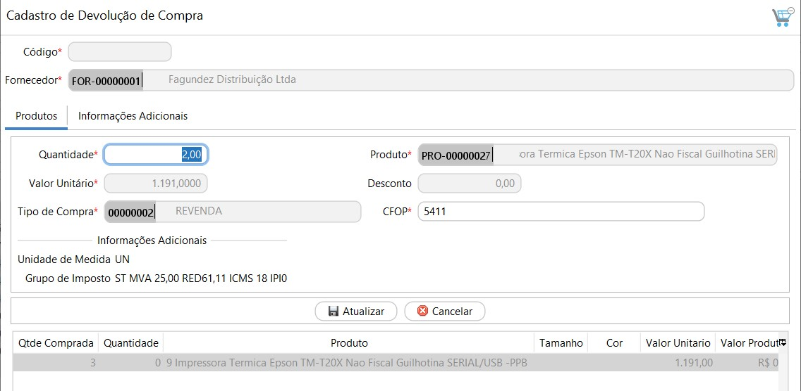

{: #redefinirimpostos}

#### Redefinir Impostos

Os impostos na Devolução de Compra são os mesmos impostos calculados na compra, são os impostos que estão parametrizados no Grupo de Imposto de compra amarrado ao produto.  O CST e CFOP são próprios para a devolução parametrizados no Grupo de Imposto de compra.

Caso necessário os impostos podem ser revisados, clicando com o botão inverso do mouse em cima da linha, em Redefinir Impostos.

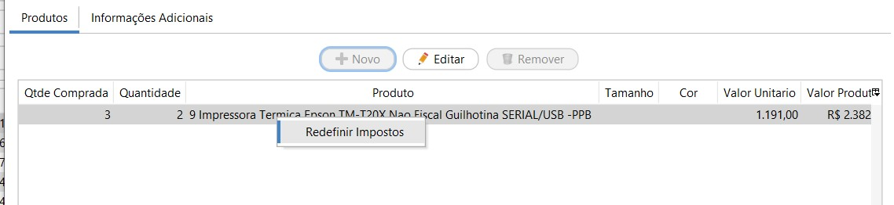

É possível alterar o grupo de impostos, e assim o sistema faz todo o recálculo dos impostos de acordo com o impostos do novo grupo selecionado:

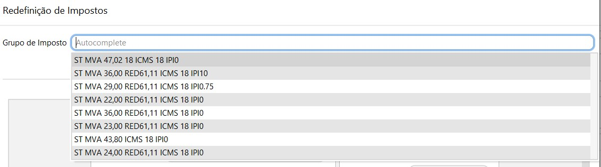

Ou pode-se alterar diretamente o valor do Imposto, Base e CST calculados, para isso o campo "Informar Manualmente" deve ser marcado, assim todos os campos permitem edição.

Ao alterar os impostos manualmente o sistema não faz nenhum novo cálculo, por exemplo se for alterado a base de cálculo o sistema não recalcula o valor do imposto. 

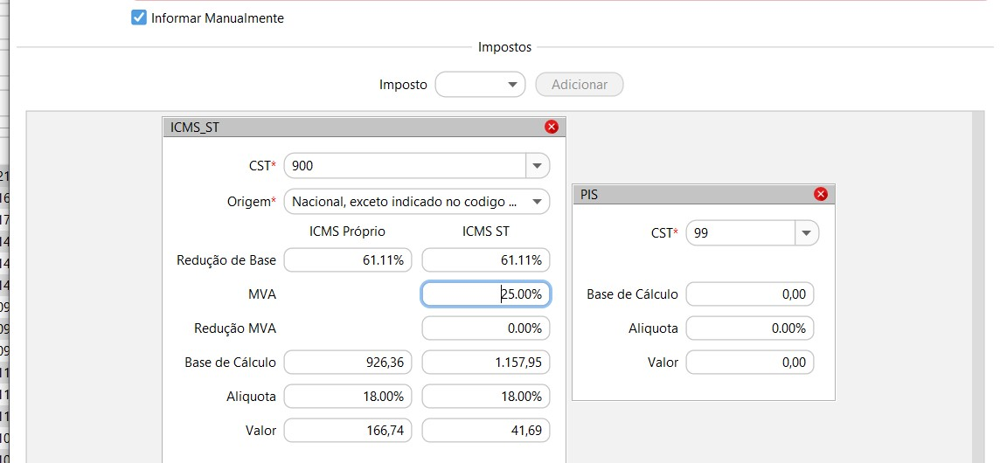

#### Informações Adicionais

##### Transporte

Na aba Transporte devem ser inseridos os valores de Frete e Seguro que compõe o valor total da Nota Fiscal. 

##### Outros

O valor de  Despesas acessórias informado neste campo será impresso em campo próprio no DANFE e irá compor o Valor Total da Nota Fiscal. Nos casos onde o valor de imposto deva ser informado como despesas acessórias, o valor deverá ser preenchido automaticamente neste campo, caso seja calculado pelos grupos de impostos, os valores serão impressos nos campos próprios de imposto.

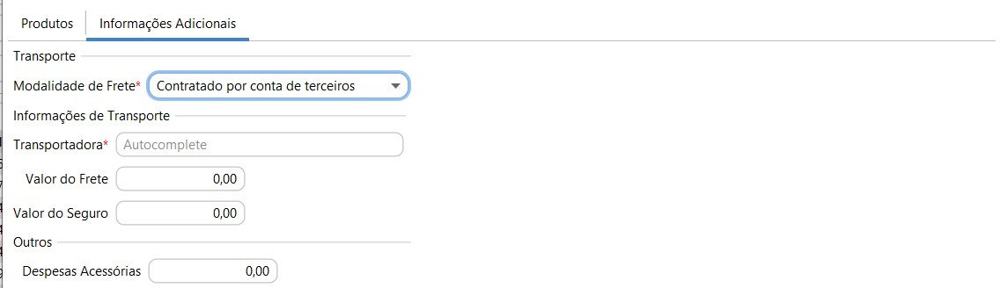

Ao clicar no botão Gravar a Devolução de Venda poderá ser faturada no mesmo momento ou então será salva com status aberto na pesquisas da Devolução de Compra.

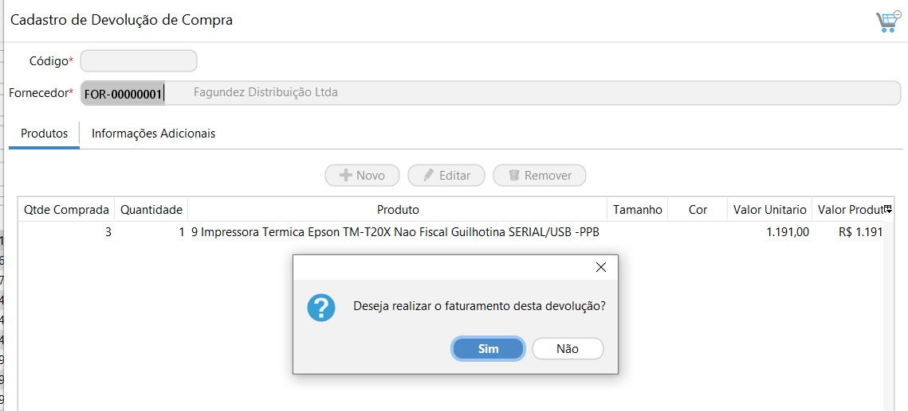

{: #faturamento}

#### Faturamento

Nesta tela é feito o faturamento da Devolução de Compras, as informações estão dispostas em 3 abas:

{: #produtos}

##### Faturamento de Devolução de Venda aba Produtos

Esta  também é uma aba apenas informativa, onde poderá ser feita a conferência dos produtos que estão sendo devolvidos.

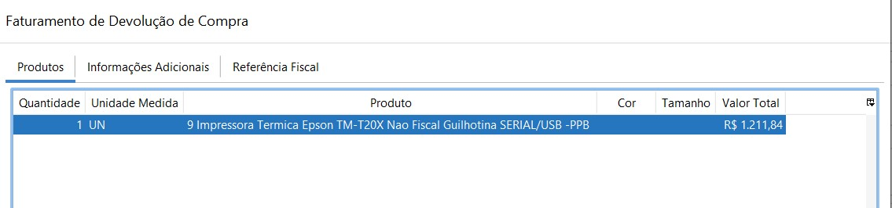

{: #informacoesadicionais}

##### Faturamento de Devolução de Compra aba Informações Adicionais

###### Frete

Caso houver frete destacado na Devolução de compra nesta aba devem ser inseridas as informações relacionadas ao Volume da Mercadoria.

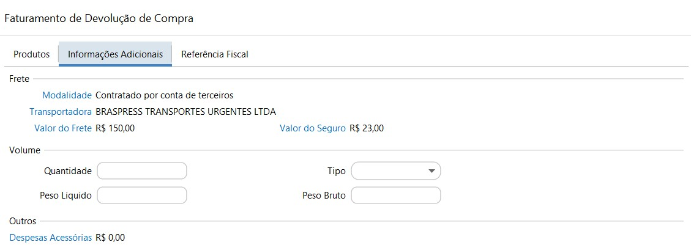

{: #textos}

###### Textos

Ainda na tela de Informações Adicionais podem ser adicionados os textos que serão impressos no rodapé do DANFE.

*Informações Adicionais*: São informações complementares de interesse do contribuinte. Será impresso no rodapé do DANFE e na tag <infCpl> do XML. Como por exemplo número de Lote, prazo de devolução, etc...

*Informações Fiscais*: São informações complementares de interesse do Fisco. Será impresso no rodapé do DANFE e na tag <infAdFisco> do XML. Como por exemplo informações de redução de base, empresa optante pelo Simples Nacional, etc...

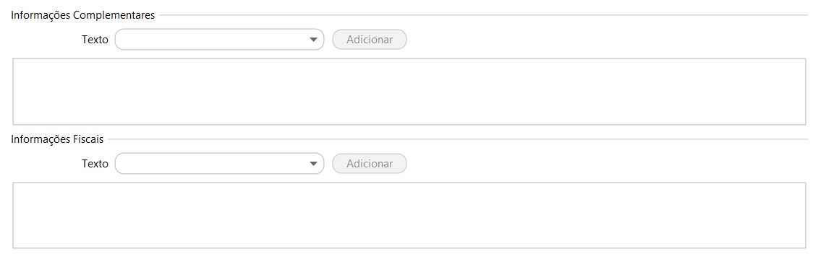

{: #referenciafiscal}

##### Faturamento de Devolução de Compra aba Referência Fiscal

As informações de referência fiscal são obrigatórias para o faturamento da Devolução de Compra. Se a Devolução de Venda for criada a partir de uma Venda, essas informações já vem preenchidas e não podem ser alteradas. Se a Devolução de compra foi criada manualmente as informações de referência fiscal devem ser informadas manualmente.

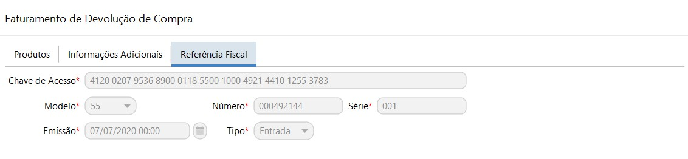

 Ao efetuar o faturamento da Devolução de Compra, a Nota Fiscal estará disponível na tela de Gestão de Documentos fiscais e pode ser filtrada pela Origem específica.

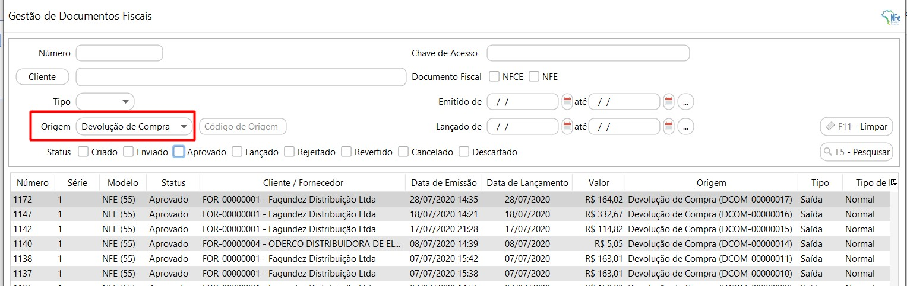

[Voltar](compras.md)