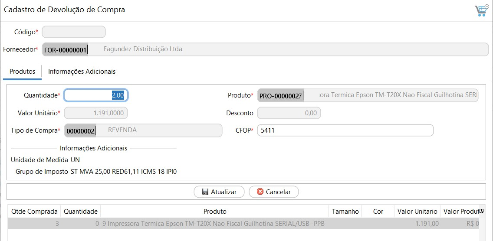

[Início](index.md) / [Compras](compras.md) / Devolução de Compra

{: #devolucaocompra}

### Devolução de Compra

E possível fazer uma devolução de compra de duas maneiras:

1ª através do menu próprio de Devolução de compra, onde neste caso a devolução é criada integralmente, informando o fornecedor e produtos manualmente. Este menu é indicado quando a compra que está sendo devolvida não está lançada no sistema ou se está fazendo uma única devolução para mais de uma compra. 

2º A segunda maneira é através do atalho que fica no botão mais na pesquisa de compras, neste caso ao abrir a devolução de compra a partir de uma compra o sistema já traz automaticamente preenchido o fornecedor e os produtos da compra, sendo necessário apenas indicar a quantidade que será devolvida nos itens que serão devolvidos.

