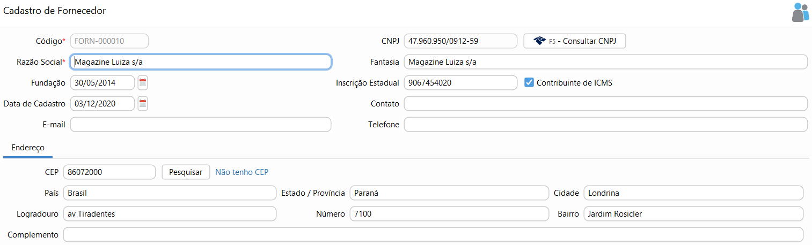

{: #cadastro}

### Fornecedor

Nesta tela devem ser cadastrados todos as Fornecedores que a  empresa tem e movimenta.

Deve-se atentar aos campos de endereço e Inscrição estadual pois eles sairão na NF-e no caso de uma Devolução de Compra.

Quando o contribuinte for ISENTO de inscrição estadual, deve-se escrever ISENTO no campo específico. Quando o contribuinte não tiver inscrição estadual deixar o campo em branco e não marcar o campo Contribuinte ICMS.

{: #credito}

#### Crédito de Fornecedor

Através do botão `Mais` no canto direito inferior da tela é possível acessar o menu Crédito.

Neste menu ficam disponíveis as transações que geraram crédito para o fornecedor. Essas transações podem ser originadas de uma movimentação manual de Caixa ou Banco, onde neste caso paga-se um valor adiantado para o Fornecedor, ou pode ser decorrente de uma devolução de compra.

O abatimento do crédito pode ser feito através do lançamento da Compra, do Contas a Pagar ou até mesmo pela movimentação manual de banco ou caixa, quando a opção "Liquidar crédito cliente\fornecedor" estiver marcada no motivo.

Quando o crédito for totalmente liquidado ele ficará com status liquidado.

[Voltar](compras.md#compras)