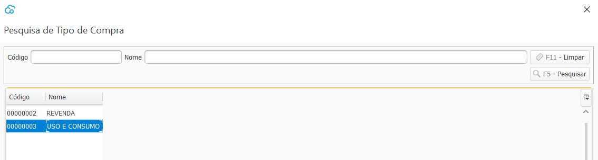
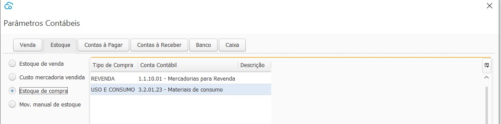

{: #cadastro}

### Tipo de Compra

Nesta tela devem ser cadastrados todos os Tipo de compra de acordo com sua contabilização.

 

Para cada tipo de Compra deverá ser parametrizada uma conta de estoque de compra nos [Parâmetros Contábeis](contabilidade_parametro_contabil_estoque.md#estoque).

[Voltar](compras.md#compras)