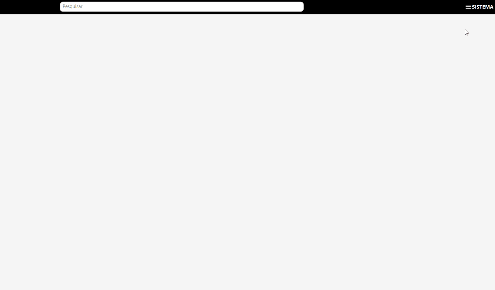
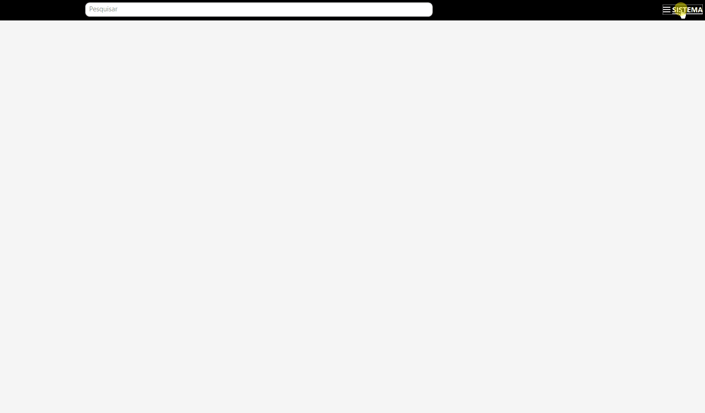
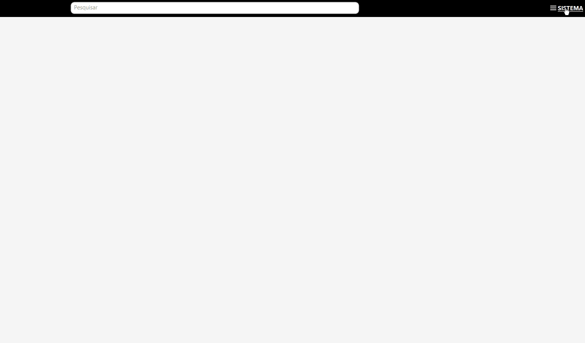

[Início](index.md) / Configurações para Emissão de NFC-e

{: #configuracoes_emissao_nfce}

## Configurações para Emissao NFC-e

Siga o passo a passo a seguir para configurar o sistema para emissão de NFC-e, Nota Fiscal de consumidor eletrônica.

#### 1º Importar o Certificado Digital

Se você já fez as  Configurações para Emissão de NF-e você pode pular esta etapa.

Acesse o Menu Sistema>>Certificado Digital e faça a importação do certificado digital de sua empresa e informe a senha de acesso ao certificado.

#### 2º Informar a Série da NFC-e 

Acesse o Menu Sistema>>Parametrização>>Fiscal>>NFc-e e informe a Série da NF-e que será emitida.

Neste mesmo mesmo menu existem outros parâmetros referente a emissão de NF-e que já vem pré-configurados com a instalação do sistema mas que podem ser alterados se necessário. Veja na documentação específica do menu [sistema](sistema_parametrizacao#nfce) a funcionalidade de cada campo.

#### 3º Informar CSC Token e Id do Tokenda NFC-e 

Acesse o Menu Sistema>>Parametrização>>Fiscal>>NFC-e e o CSC Token e o ID do Token.

Para mais informações como solicitar o CSC acesse: http://www.sped.fazenda.pr.gov.br/modules/conteudo/conteudo.php?conteudo=103

#### 4º Parametrize o Certificado Digital 

Se você já fez as  Configurações para Emissão de NF-e você pode pular esta etapa.

Acesse o Menu Sistema>>Parametrização>>Fiscal>>Geral e parametrize o Certificado Digital importado anteriormente.

Neste mesmo mesmo menu existem outros parâmetros referente a emissão de NF-e que já vem pré-configurados com a instalação do sistema mas que podem ser alterados se necessário. Veja na documentação específica do menu [sistema](sistema_parametrizacao#geral) a funcionalidade de cada campo.

Se você ainda não emitiu nenhuma NFC-e anteriormente as configurações para emissão de NFC-e terminam aqui. Se você já é um emissor de NFC-e siga para próxima etapa.

#### 5º Atualize a Sequência Numérica

Acesse o Menu Sistema>>Sequência Numérica, pesquise pela entidade NFCe e clique em editar. No campo Próximo Sequencial informe qual deve ser o número de NFC-e a ser emitido pelo Continente. Uma vez parametrizado o sistema irá dar continuidade nesta numeração.

Se você for um emissor de NF-e veja as também as [Configurações para emissão de NF-e](configuracoes_emissao_nfe).

[Voltar](index.md)

