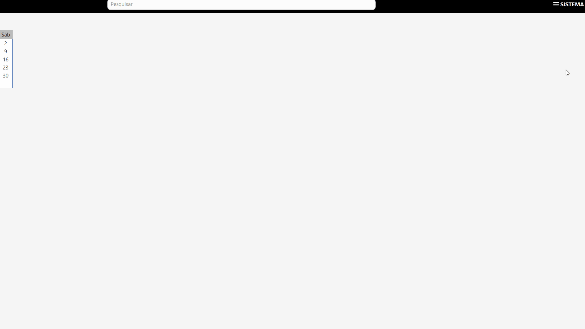
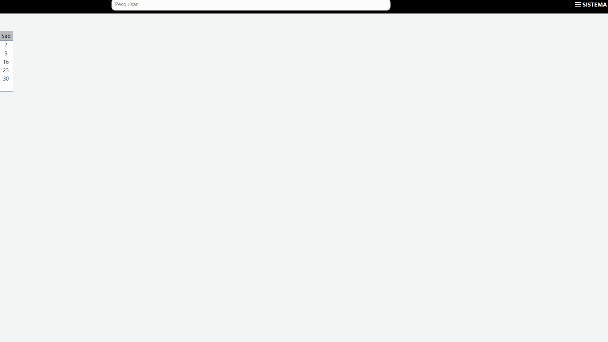

[Início](index.md) / Configurações para Emissão de NF-e

{: #configuracoes_emissao_nfe}

## Configurações para Emissão NF-e

Siga o passo a passo a seguir para configurar o sistema para emissão de NF-e.

#### 1º Importar o Certificado Digital

Acesse o Menu Sistema>>Certificado Digital e faça a importação do certificado digital de sua empresa e informe a senha de acesso ao certificado.

#### 2º Parametrize o ambiente de emissão de DF-e: Produção ou homologação

Acesse o Menu Sistema>>Parametrização>>Documento Fiscal>>Geral>>Ambiente> altere o ambiente para produção.

Na instalação do ERP Continente Nuvem esse parâmetro vem definido como homologação. O ambiente de homologação da SEFAZ é utilizado apenas para testes e não tem validade fiscal.

O parâmetro de ambiente define os ambientes de emissão de NF-e NFC-e

#### 3º Parametrize o Certificado Digital 

Acesse o Menu Sistema>>Parametrização>>Documento Fiscal>>Geral>> Certificado Digital e parametrize o Certificado Digital importado anteriormente.

#### 4º Informar a Série da NF-e

Acesse o Menu Sistema>>Parametrização>>Documento Fiscal>>NF-e e informe a Série da NF-e que será emitida.

#### 4º Atualize a Sequência Numérica

Acesse o Menu Sistema>>Sequência Numérica, pesquise pela entidade NFe e clique em editar. No campo Próximo Sequencial informe qual deve ser o número de NF-e a ser emitido pelo Continente. Uma vez parametrizado o sistema irá dar continuidade nesta numeração.

Se você for um emissor de NFC-e veja as também as [Configurações para emissão de NFC-e](configuracoes_emissao_nfce).

[Voltar](index.md)

