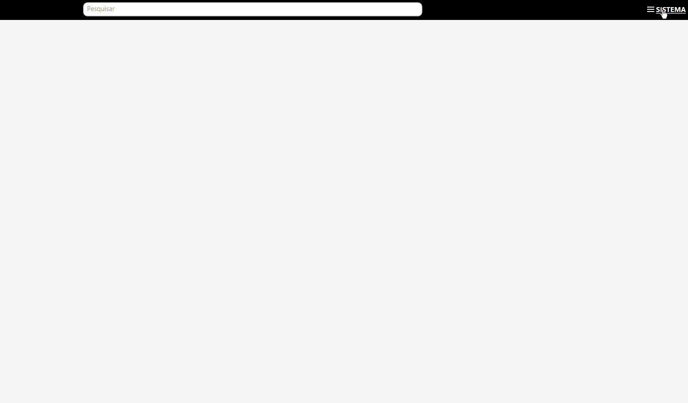
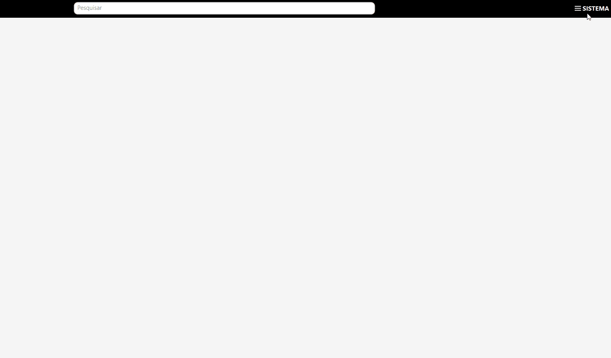

[Início](index.md) / Configurações para Emissão de NF-e

{: #configuracoes_emissao_nfe}

## Configurações para Emissao NF-e

Siga o passo a passo a seguir para configurar o sistema para emissão de NF-e.

#### 1º Importar o Certificado Digital

Acesse o Menu Sistema>>Certificado Digital e faça a importação do certificado digital de sua empresa e informe a senha de acesso ao certificado.

#### 2º Informar a Série da NF-e

Acesse o Menu Sistema>>Parametrização>>Fiscal>>NF-e e informe a Série da NF-e que será emitida.

Neste mesmo mesmo menu existem outros parâmetros referente a emissão de NF-e que já vem pré-configurados com a instalação do sistema mas que podem ser alterados se necessário. Veja na documentação específica do menu [sistema](sistema_parametrizacao#nfe) a funcionalidade de cada campo.

#### 3º Parametrize o Certificado Digital 

Acesse o Menu Sistema>>Parametrização>>Fiscal>>Geral e parametrize o Certificado Digital importado anteriormente.

Neste mesmo mesmo menu existem outros parâmetros referente a emissão de NF-e que já vem pré-configurados com a instalação do sistema mas que podem ser alterados se necessário. Veja na documentação específica do menu [sistema](sistema_parametrizacao#geral) a funcionalidade de cada campo.

Se você ainda não emitiu nenhuma NF-e anteriormente as configurações para emissão de NF-e terminam aqui. Se você já é um emissor de NF-e siga para próxima etapa.

#### 4º Atualize a Sequência Numérica

Acesse o Menu Sistema>>Sequência Numérica, pesquise pela entidade NFe e clique em editar. No campo Próximo Sequencial informe qual deve ser o número de NF-e a ser emitido pelo Continente. Uma vez parametrizado o sistema irá dar continuidade nesta numeração.

Se você for um emissor de NFC-e veja as também as [Configurações para emissão de NFC-e](configuracoes_emissao_nfce).

[Voltar](index.md)

