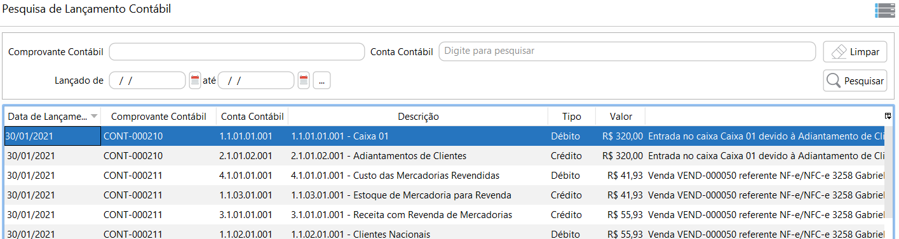
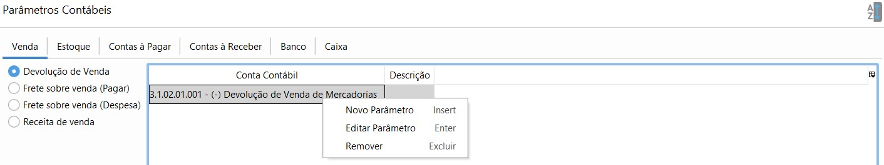
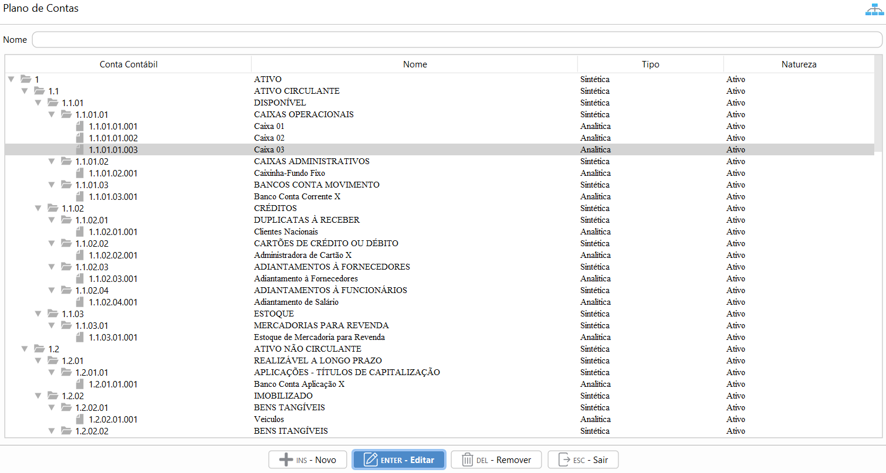

[Início](index.md) / Contabilidade

{: #contabilidade}

# Contabilidade

Neste menu estão todas as opções relacionadas a Contabilidade, desde relatório até parâmetros.

{: #lancamentocontabil}

## Lançamento Contábil

Nesta tela podem ser consultados todos os lançamentos contábeis que o sistema executa por transação.

O número do Comprovante contábil, tem por objetivo agrupar de forma unívoca, todos os registros que integram um mesmo lançamento contábil. Essa numeração segue o parametrizado no cadastro de [Sequência Numérica](sistema_sequencia_numerica.md)

{: #parametroscontabeis}

## Parâmetros Contábeis 

Nesta tela são parametrizadas as contas contábeis utilizadas em todas as transações do sistema.

A organização desta tela é feita em guias, onde temos:

|[Venda](contabilidade_parametro_contabil.md#venda)

|[Estoque](contabilidade_parametro_contabil.md#estoque)

|[Contas à Pagar](contabilidade_parametro_contabil.md#contaspagar)

|[Contas a Receber](contabilidade_parametro_contabil.md#contasreceber)

|[Banco](contabilidade_parametro_contabil.md#banco)

|[Caixa](contabilidade_parametro_contabil.md#caixa)

Para inserir, editar ou remover uma conta deve clicar com o botão inverso do mouse ou utilizar os atalhos  visíveis na tela acima.

{: #planocontas}

## Plano de Contas

O plano de contas vem previamente cadastrado na instalação do sistema. Devendo ser manutenido conforme a necessidade de cada empresa.

A Conta Pai é a conta sintética superior a que está sendo inserida.

Tipo de Conta: *Sintética* : é a conta agrupadora, ou seja, não há lançamentos contábeis nela especificamente. Ela é o resultado da soma das contas analíticas da qual ela for a conta Pai.

​                            *Analítica*: é a conta que recebe o lançamento contábil propriamente dito. Somente contas analíticas podem ser parametrizadas nos [Parâmetros Contábeis](contabilidade.md#parametroscontabeis)

O plano de contas, com da todas as suas contas sintéticas e analíticas, deve conter, no mínimo, 4 (quatro) níveis e é parte integrante escrituração contábil da entidade, devendo seguir a estrutura patrimonial prevista nos arts. 177 a 182 da [Lei 6.404/1976](http://www.normaslegais.com.br/legislacao/contabil/lei6404_1976.htm).

[Voltar](index.md)