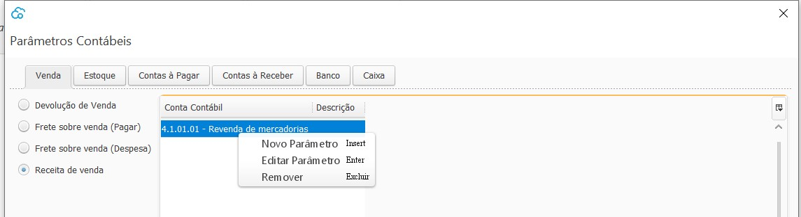

Parâmetros Contábeis
------------------------
Nesta tela são parametrizadas as contas contábeis utilizadas em todas as transações do sistema.

A organização desta tela é feita em guias, onde temos:

- [Venda](contabilidade_parametro_contabil_venda.md)

- [Estoque](contabilidade_parametro_contabil_estoque.md)

- [Contas à Pagar](contabilidade_parametro_contabil_contas_pagar.md)

- [Contas a Receber](contabilidade_parametro_contabil_contas_receber.md)

- [Banco](contabilidade_parametro_contabil_banco.md)

- [Caixa](contabilidade_parametro_contabil_caixa.md)

  

Para inserir, editar ou remover uma conta deve clicar com o botão inverso do mouse ou utilizar os atalhos  visíveis na tela acima.

[Voltar](sistema.md)

