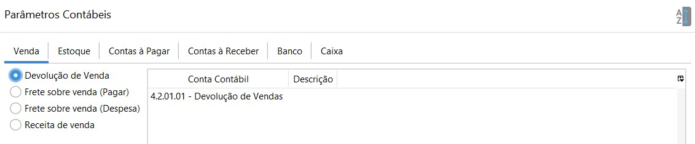
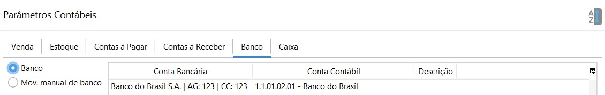

[Início](index.md) / [Contabilidade](contabilidade.md) / Parâmetros Contábeis

{: #venda}

### Parâmetros Contábeis- Venda

- Devolução de Venda: onde é lançado a devolução de vendas. Conta de Resultado – Deduções de vendas

- Frete sobre venda (Pagar): onde é lançado o frete destacado na venda. Pode-se utilizar  a mesma conta de Fornecedores em geral ou uma específica para Fretes a pagar. Conta do Passivo Circulante.

  

- Frete sobre venda (Despesa): onde é lançado o frete destacado na venda. Frete é contabilizado como despesa para quem vende, mesmo que o comprador pague. Conta de Despesas – Despesas Operacionais

  

- Receita de venda: onde é lançado a receita de vendas, Conta Contábil de Resultado-Receita.

{: #estoque}

### Parâmetros Contábeis- Estoque

- Estoque de venda: onde é lançado a saída do estoque pelas vendas. Conta Contábil do Ativo Circulante.

- Custo  mercadoria vendida: onde é lançado o custo da mercadoria na entrada do estoque pelas compras. Contábil de Resultado (Despesa)

- Estoque de compra: onde é lançado a entrada do estoque pelas compras. Sendo uma para cada Tipo de Compra. Conta Contábil do Ativo Circulante.

- Mov. manual de estoque: onde é lançado as transações feitas pela movimentação manual de estoque. Cada motivo de Movimentação manual de estoque deve ser amarrado há uma conta contábil. Essa parametrização poder ser feita diretamente no cadastro do motivo ou nos Parâmetros Contábeis.

  Ou seja, a conta contábil parametrizada no cadastro do motivo de movimentação manual de estoque ficará visível também nos Parâmetros contábeis e vice-versa.

  

{: #contaspagar}

### Parâmetros Contábeis- Contas à Pagar

- Cartão corporativo: onde é lançado as compras feitas em cartão de crédito corporativo. Conta Contábil do Passivo Circulante.

- Fornecedor: onde é lançado os valores à pagar para fornecedores. Conta Contábil do Passivo Circulante.
- Multa pago: onde é lançado os valores de multa pagos para fornecedores. Conta Contábil de Resultado (Despesa).
- Juros pago: onde é lançado os valores de juros pagos para fornecedores. Conta Contábil de Resultado (Despesa) 
- Mov. manual de cartão corp: onde é lançado as transações feitas pela movimentação manual no processo de Conciliação de Cartão Corporativo. Cada motivo de Movimentação manual deve ser amarrado há uma conta contábil. Essa parametrização poder ser feita diretamente no cadastro do motivo ou nos Parâmetros Contábeis.
- Desconto Obtido: onde é lançado os valores de desconto obtidos no pagamento de uma parcela no Contas à Pagar. Conta Contábil de Resultado-Receitas.

{: #contasreceber}

### Parâmetros Contábeis- Contas à Receber

- Cliente: onde é lançado os valores à receber de clientes, ou seja, todo faturamento feito em cheque ou crediário. Conta Contábil do Ativo Circulante.

  

- Administradora de cartão: onde é lançado os valores a receber em  Cartão, ou seja, todo faturamento em Cartão, como o Débito, Crédito, Refeição, descontado as taxas. Conta Contábil do Ativo Circulante.

  

- Taxa administrativa do cartão: onde é lançado os valores de taxas da administradora de cartão ou de antecipação de cartão que foram calculadas de acordo com os percentuais previamente cadastrados no [Cadastro da administradora de Cartão](financeiro_administradora_cartao.md). Conta Contábil de Resultado-Despesas-Despesas Financeiras.

  

- Juros recebido: onde é lançado os valores de juros provenientes de recebíveis de clientes. Conta Contábil de Resultado-Receita-Receitas Financeiras.

  

- Multas recebido: onde é lançado os valores multa provenientes de recebíveis de clientes. Conta Contábil de Resultado-Receita-Receitas Financeiras.

  

- Desconto Concedido: onde é lançado os valores de desconto provenientes de recebíveis de clientes. Conta Contábil de Resultado-Despesas-Despesas Financeiras.

{: #banco}

### Parâmetros Contábeis- Banco

- Banco: onde é lançado os valores das transações bancárias. Deve-se parametrizar uma conta contábil para cada banco cadastrado. Essa parametrização poder ser feita diretamente no cadastro do banco ou nos Parâmetros Contábeis.

  

- Mov. manual de banco: onde é lançado as transações feitas pela movimentação manual de banco. Cada motivo de Movimentação manual de banco deve ser amarrado há uma conta contábil. Essa parametrização poder ser feita diretamente no cadastro do motivo ou nos Parâmetros Contábeis.

  Ou seja, a conta contábil parametrizada no cadastro do motivo de movimentação manual de banco ficará visível também nos Parâmetros contábeis e vice-versa.

  

  {: #caixa}

  ### Parâmetros Contábeis- Caixa

  

  

- Caixa:  onde é lançado os valores das transações de caixa. Deve-se parametrizar uma conta contábil para cada caixa cadastrado. Essa parametrização poder ser feita diretamente no cadastro do caixa ou nos Parâmetros Contábeis.

- Mov. Manual de Caixa: onde é lançado as transações feitas pela movimentação manual de caixa. Cada motivo de Movimentação manual de caixa deve ser amarrado há uma conta contábil. Essa parametrização poder ser feita diretamente no cadastro do motivo ou nos Parâmetros Contábeis.

  Ou seja, a conta contábil parametrizada no cadastro do motivo de movimentação manual de caixa ficará visível também nos Parâmetros contábeis e vice-versa.

  

-  Quebra de caixa: onde é lançado o valor da diferença entre o dinheiro conferido e o registrado no fechamento de caixa. 

  

- Fechamento de caixa: onde é lançado o valor informado como conferido no fechamento de caixa.

[Voltar](contabilidade.md#parametroscontabeis)

