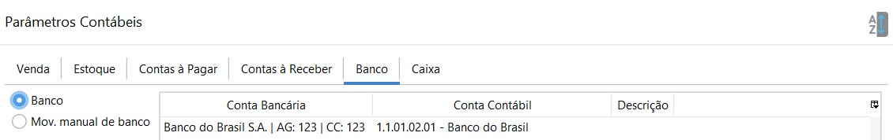
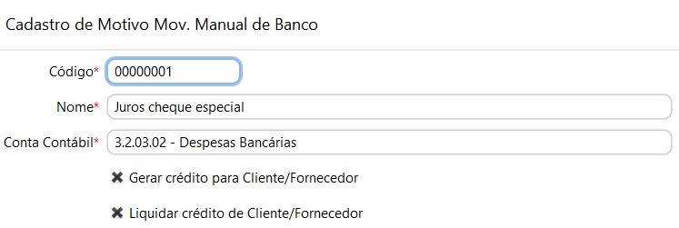
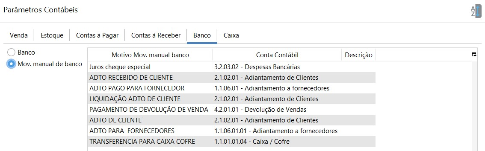

Banco

- Banco: onde é lançado os valores das transações bancárias. Deve-se parametrizar uma conta contábil para cada banco cadastrado. Essa parametrização poder ser feita diretamente no cadastro do banco ou nos Parâmetros Contábeis.

- Mov. manual de banco: onde é lançado as transações feitas pela movimentação manual de banco. Cada motivo de Movimentação manual de banco deve ser amarrado há uma conta contábil. Essa parametrização poder ser feita diretamente no cadastro do motivo ou nos Parâmetros Contábeis.

  Ou seja, a conta contábil parametrizada no cadastro do motivo de movimentação manual de banco

  
  
  ficará visível também nos Parâmetros contábeis e vice-versa.
  
  
  
  
  
  
  
  [Voltar](contabilidade.md)

