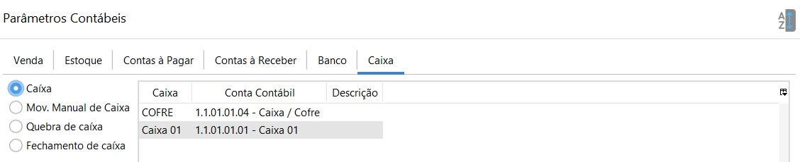
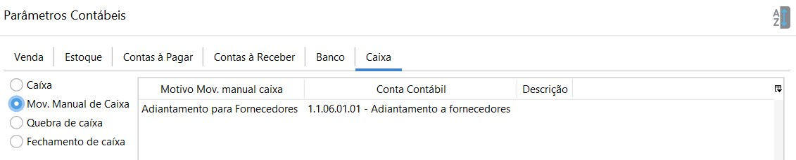

### Caixa

- Caixa:  onde é lançado os valores das transações de caixa. Deve-se parametrizar uma conta contábil para cada caixa cadastrado. Essa parametrização poder ser feita diretamente no cadastro do caixa ou nos Parâmetros Contábeis.

  

- Mov. Manual de Caixa: onde é lançado as transações feitas pela movimentação manual de caixa. Cada motivo de Movimentação manual de caixa deve ser amarrado há uma conta contábil. Essa parametrização poder ser feita diretamente no cadastro do motivo ou nos Parâmetros Contábeis.

  Ou seja, a conta contábil parametrizada no cadastro do motivo de movimentação manual de caixa

  

  ficará visível também nos Parâmetros contábeis e vice-versa.

  

  

- Quebra de caixa:

  

- Fechamento de caixa:

[Voltar](contabilidade.md)

