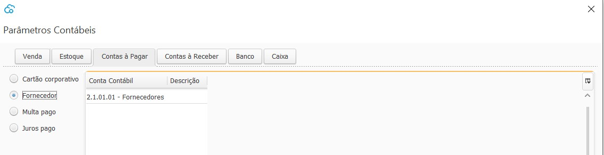

Contas à Pagar

- Cartão corporativo:
- Fornecedor: onde é lançado os valores à pagar para fornecedores, Conta Contábil do Passivo Circulante, Tipo analítica.
- Multa pago: onde é lançado os valores de multa pagos para fornecedores. Conta Contábil de Resultado (Despesa) Tipo analítica
- Juros pago: onde é lançado os valores de juros pagos para fornecedores. Conta Contábil de Resultado (Despesa) Tipo analítica

[Voltar](ajustes_contabilidade.md)

