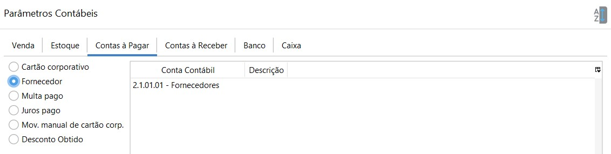
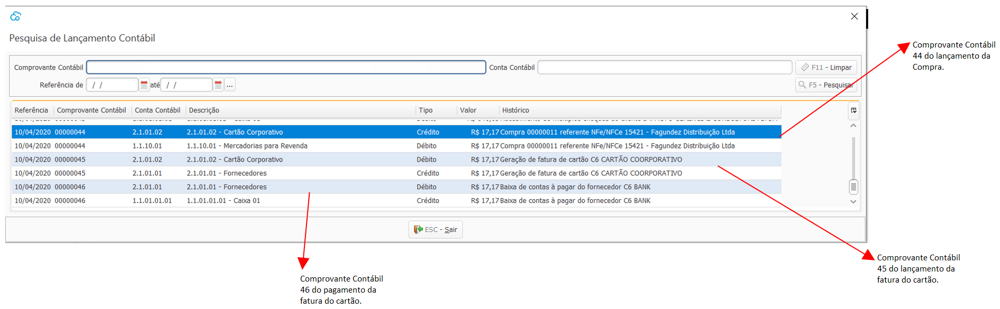

### Contas à Pagar

- Cartão corporativo: onde é lançado as compras feitas em cartão de crédito corporativo. Exemplo:

  

- Fornecedor: onde é lançado os valores à pagar para fornecedores, Conta Contábil do Passivo Circulante.

- Multa pago: onde é lançado os valores de multa pagos para fornecedores. Conta Contábil de Resultado (Despesa).

- Juros pago: onde é lançado os valores de juros pagos para fornecedores. Conta Contábil de Resultado (Despesa) 

[Voltar](contabilidade.md)

