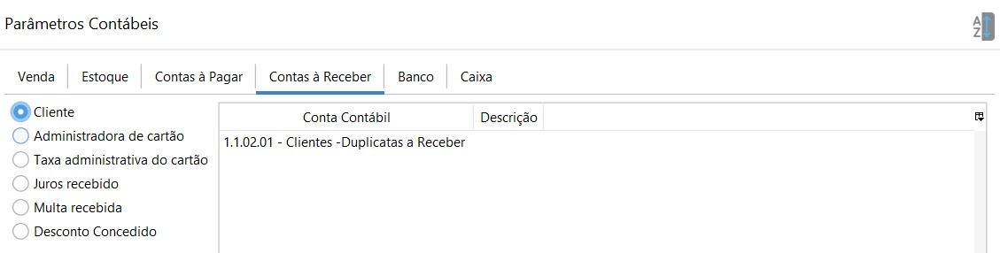

Contas à Receber

- Cliente: onde é lançado os valores à receber de clientes, ou seja, todo faturamento feito em cheque ou crediário. Conta Contábil do Ativo Circulante.
- Administradora de cartão: onde é lançado os valores a receber em  Cartão, ou seja, todo faturamento em Cartão, como o Débito, Crédito, Refeição, descontado as taxas. Conta Contábil do Ativo Circulante.
- Taxa administrativa do cartão: onde é lançado os valores de taxas da administradora de cartão ou de antecipação de cartão que foram calculadas de acordo com os percentuais previamente cadastrados no [Cadastro da administradora de Cartão](financeiro_administradora_cartao.md). Conta Contábil de Resultado-Despesas-Despesas Financeiras.
- Juros recebido: onde é lançado os valores de juros provenientes de recebíveis de clientes. Conta Contábil de Resultado-Receita-Receitas Financeiras.
- Multas recebido: onde é lançado os valores multa provenientes de recebíveis de clientes. Conta Contábil de Resultado-Receita-Receitas Financeiras.
- Desconto Concedido: onde é lançado os valores de desconto provenientes de recebíveis de clientes. Conta Contábil de Resultado-Despesas-Despesas Financeiras.

[Voltar](contabilidade.md)

