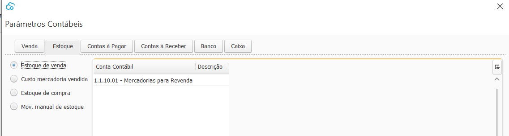

Estoque

- Estoque de venda:
- Custo  mercadoria vendida: Conta Contábil de Resultado (Despesa), Tipo analítica.
- Estoque de compra: Conta Contábil do Ativo Circulante, Tipo analítica.
- Mov. manual de estoque:

[Voltar](ajustes_contabilidade.md)

