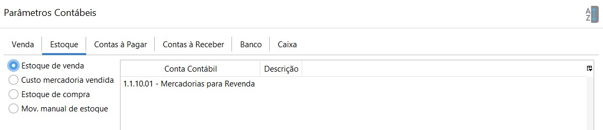
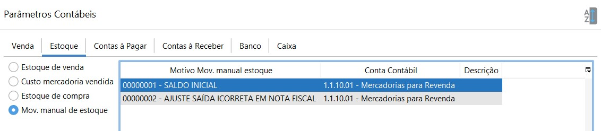
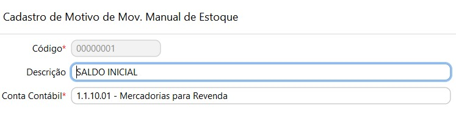

### Parâmetros Contábeis- Estoque

- Estoque de venda: onde é lançado a saída do estoque pelas vendas. Conta Contábil do Ativo Circulante.

- Custo  mercadoria vendida: onde é lançado o custo da mercadoria na entrada do estoque pelas compras. Contábil de Resultado (Despesa)

- Estoque de compra: onde é lançado a entrada do estoque pelas compras. Sendo uma para cada Tipo de Compra. Conta Contábil do Ativo Circulante.

- Mov. manual de estoque: onde é lançado as transações feitas pela movimentação manual de estoque. Cada motivo de Movimentação manual de estoque deve ser amarrado há uma conta contábil. Essa parametrização poder ser feita diretamente no cadastro do motivo ou nos Parâmetros Contábeis.

   Ou seja, a conta contábil parametrizada no cadastro do motivo de movimentação manual de estoque

  

  

  ficará visível também nos Parâmetros contábeis e vice-versa.

  

  

[Voltar](contabilidade.md)

