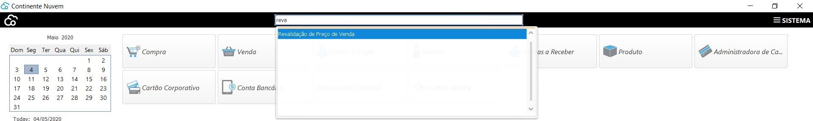
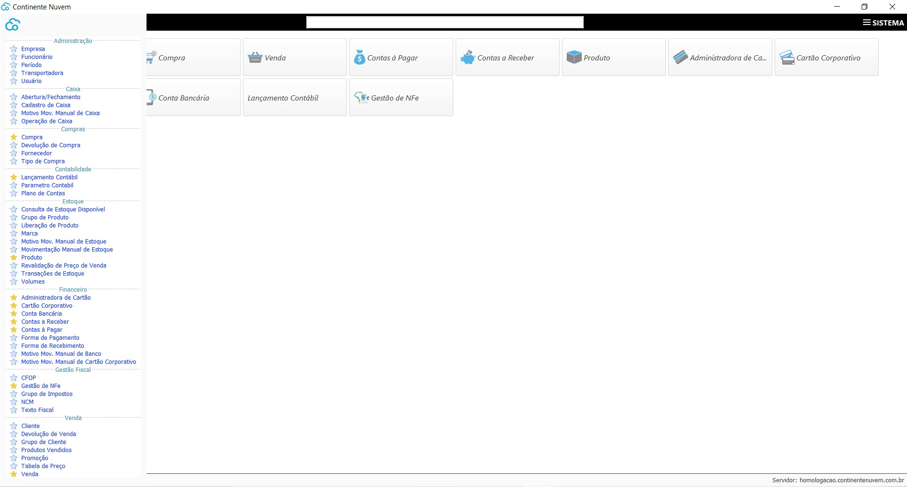
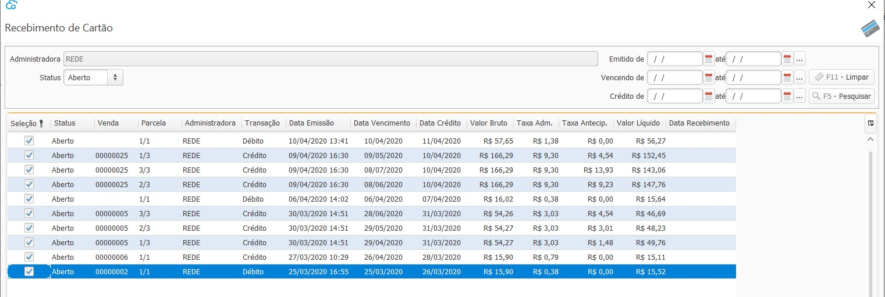
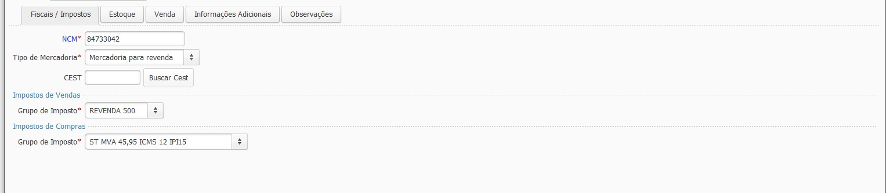
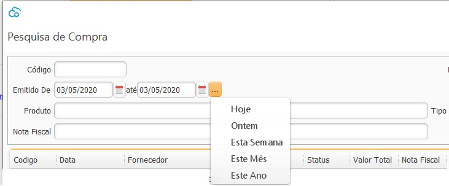
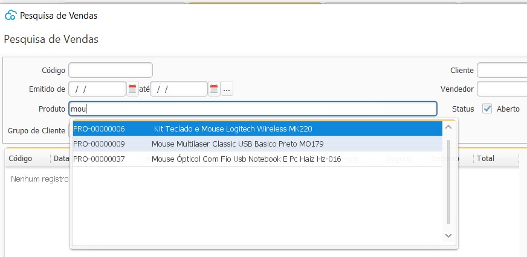
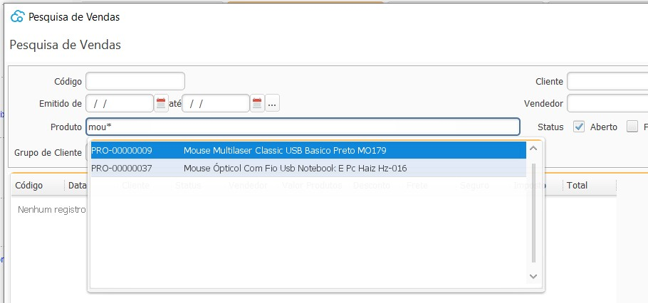
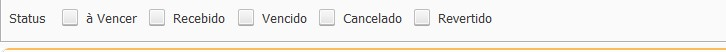
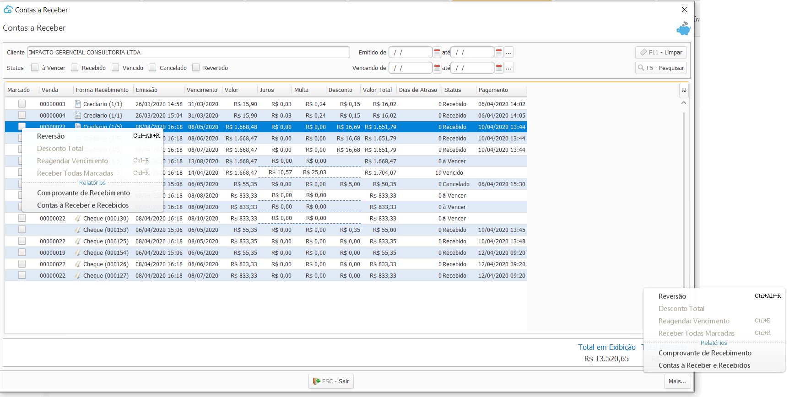

{: #dicas}

## Dicas de Usabilidade    

Aqui você vai encontrar as dicas que vão facilitar ainda mais a utilização do Continente Nuvem. Não esqueça de entrar aqui sempre pois estamos constantemente melhorando a usabilidade do CN.

#### Barra de pesquisa

Essa é uma daquelas ferramentas aliadas, principalmente para abrir aquelas telas que não são usadas no dia-a -dia e que não estão no seu menu de favoritos.  

Ao pesquisas na barra de pesquisa pode-se abrir qualquer tela ou relatório, basta digitar parcialmente o nome e não  é necessário direcionar o cursor dentro da barra, quando estiver no meu principal basta digitar em qualquer lugar da tela que o cursor será automaticamente direcionado para barra.

#### Favoritos

Essa é outra funcionalidade mão-na-roda do Continente Nuvem, na lateral esquerda da tela, ao clicar na logo do continente, a barra de Menu lateral é aberta, com todas as opções do de Menu que o usuário tem acesso. Ao clicar na estrela no início do menu, ele entra para o menu de favoritos e o acesso estará disponível na tela principal.

#### Marcar Todos

Marcar todos os registros é muito mais rápido através do atalho `Ctrl+A`

 

#### Abas

Através do atalho `F8 `  em todas as telas você passar por todas as abas sem precisar usar o mouse.

 

#### Data

Lembre-se destes atalhos sempre que você ver o campo de data. Não importa se letra maiúscula ou minúscula:

Para inserção no sistema:

`h` preenche a data de hoje

`o` preenche a data de ontem

`a` preencher a data de amanhã

Para consulta de data, Campo De Até:

`Ctrl+h` preenche a data de hoje até hoje

`Ctrl+o` preenche a data de ontem até ontem

`Ctrl+s` preenche a data da segunda-feira até domingo

`Ctrl+m` preenche a data do primeiro dia do mês até o último dia do mês

`Ctrl+n` preenche a data do primeiro dia do ano até o último dia do ano 

 

#### Pesquisa parcial

Todos os campos de pesquisa funcionam por partes fracionadas das palavras, ou, seja o sistema busca por registros que contenham em qualquer parte o registro pesquisado,

 

Para limitar a busca ao início ou final da frase você pode utilizar o *. 

Se o * for utilizado no final da busca o sistema vai trazer todos os registros que iniciam, se o * for utilizado no início da busca o sistema vai trazer todos os registros que terminam.

 

#### Pesquisa campo de caixa de seleção

Para utilizar todos os filtros que estão no formato de caixa de seleção ou *checkbox*  não é necessário marcar todos, se nenhum estiver marcado o sistema irá buscar todos.

 

#### Botão Mais

Sempre que você ver o botão Mais em uma tela, todas as opções de acesso estarão também disponíveis clicando com o botão inverso do mouse, ou ainda através de atalhos específicos que iniciam sempre com a tecla Ctrl.

[Voltar](index.md)

