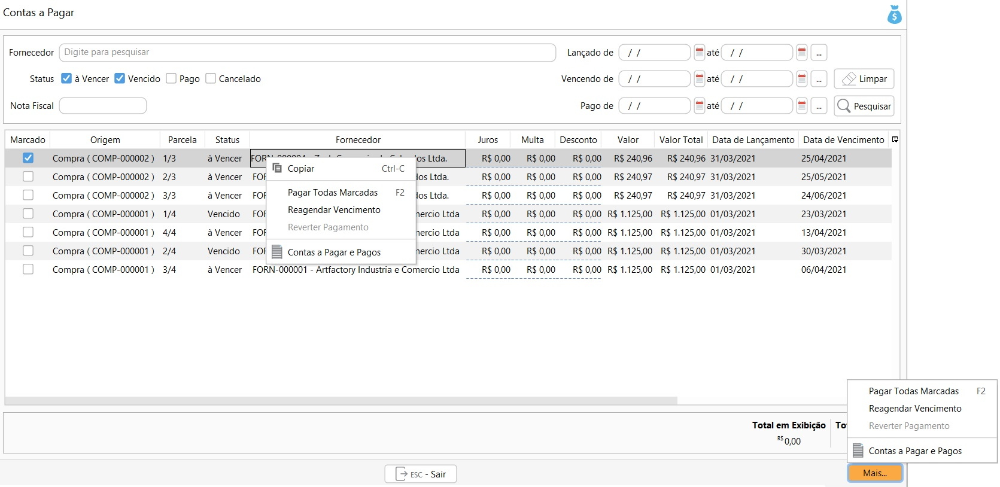

{: #dicas}

## Dicas    

Aqui você vai encontrar as dicas que vão facilitar ainda mais a utilização do Continente Nuvem. Não esqueça de entrar aqui sempre pois estamos constantemente melhorando a usabilidade do CN.

#### Botão Mais

Sempre que você ver o botão Mais em uma tela, todas as opções de acesso estarão também disponíveis clicando com o botão inverso do mouse, ou ainda através de atalhos específicos que iniciam sempre com a tecla Ctrl.

#### Marcar Todos

Marcar todos os registros é muito mais rápido através do atalho `Ctrl+A`

 

#### Data

Lembre-se destes atalhos sempre que você ver o campo de data. Não importa se letra maiúscula ou minúscula:

Para inserção no sistema:

h- preenche a data de hoje

o- preenche a data de ontem

a- preencher a data de amanhã

Para consulta de data, Campo De Até:

Ctrl+h- preenche a data de hoje até hoje

Ctrl+o- preenche a data de ontem até ontem

Ctrl+s- preenche a data da segunda-feira até domingo

Ctrl+m- preenche a data do primeiro dia do mês até o último dia do mês

Ctrl+n- preenche a data do primeiro dia do ano até o último dia do ano 

 

#### Pesquisa parcial

Todos os campos de pesquisa funcionam por partes fracionadas das palavras, ou, seja o sistema busca por registros que contenham em qualquer parte o registro pesquisado,

 

Para limitar a busca ao início ou final da frase você pode utilizar o *. 

Se o * for utilizado no final da busca o sistema vai trazer todos os registros que iniciam, se o * for utilizado no início da busca o sistema vai trazer todos os registros que terminam.

 

#### Pesquisa campo de caixa de seleção

Para utilizar filtros que estão no formato de caixa de seleção ou *checkbox*  não é necessário marcar todos, se nenhum estiver marcado o sistema irá buscar todos.

 

[Voltar](index.md)