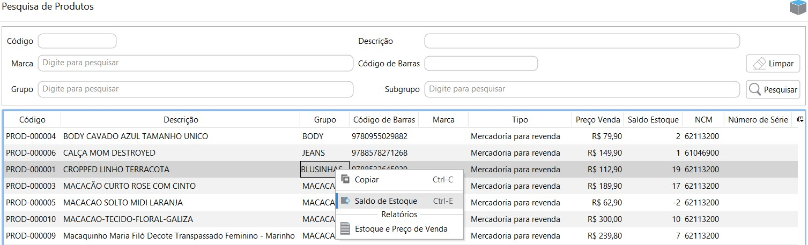
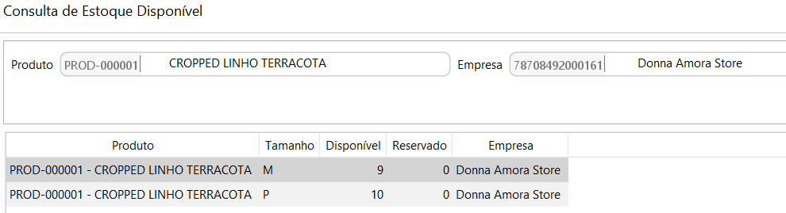
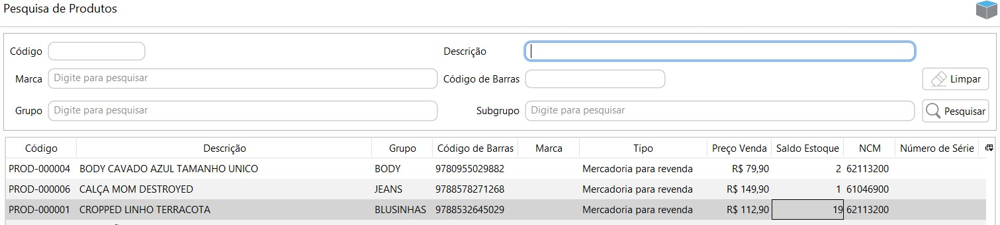

{: #consultaestoque}

### Consulta de Estoque Disponível

É  possível acessar a tela para consulta de estoque disponível pelo próprio menu de Consulta de Estoque disponível ou no cadastro de produto, no botão mais ou através do atalho `Ctrl+E`:

Nesta tela é possível consultar o estoque disponível por produto e dimensões de estoque para todas as empresas cadastradas.

No cadastro do produto, na grade também fica disponível o saldo por produto, mas neste caso agrupado por todas as dimensões de estoque e apenas na empresa logada:

[Voltar](estoque.md#estoque)

