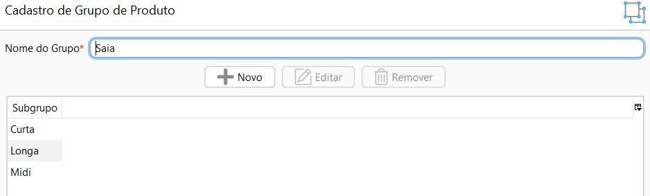

[Início](index.md) / [Estoque](estoque.md) / Grupo de Produto

{: #grupoproduto}

### Grupo de Produto

Nesta tela é possível cadastrar os grupos de produtos que a empresa trabalha. Esse agrupamento deve ser feito segundo as características em comum dos produtos, como, por exemplo, padrões de forma, peso, tipo, uso, dimensão entre outros.

A utilização de grupo de produtos não é obrigatória, mas quando os produtos estão reunidos em grupos, se torna mais prático selecioná-los nas operações de processamento, geração de consultas e emissão de relatórios 

{: #subgrupo}

#### Subgrupo

Ao cadastrar um grupo de produtos, pode-se também associar subgrupos de produtos, que servem para um maior detalhamento do grupo de produto.

[Voltar](estoque.md#estoque)

