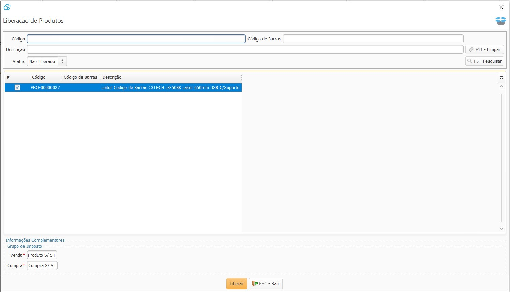

{: #liberacaoproduto}

### Liberação de Produto

Essa tela serve para fazer-se disponíveis no cadastro de produto de uma empresa os produtos que foram cadastrados em outra empresa.

Para isso deve-se informar os grupos de impostos que serão utilizados no produto, visto que o grupo de impostos são cadastrados por empresa.

Ao efetuar a liberação o produto fica disponível para as transações na empresa que efetuou a liberação.

[Voltar](estoque.md#estoque)

