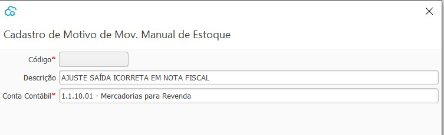

{: #cadastro}

### Motivo Movimentação Manual de Estoque

Nesta tela devem ser cadastrados todos os Motivos que serão utilizados na [Movimentação Manual de Estoque](estoque_movimentacao_manual.md#movimentacaomanual).

Como por exemplo um ajuste de estoque devido há um faturamento incorreto, onde neste caso deve-se entrar com o produto que foi faturado indevidamente e sair com o produto correto.

É importante ressaltar que toda movimentação de estoque deve ter seu respectivo documento Fiscal originário.

Cada motivo deve ser amarrado há uma conta contábil e essa conta contábil é utilizada no lançamento contábil da transação de movimentação manual de Estoque.

[Voltar](estoque.md#estoque)

