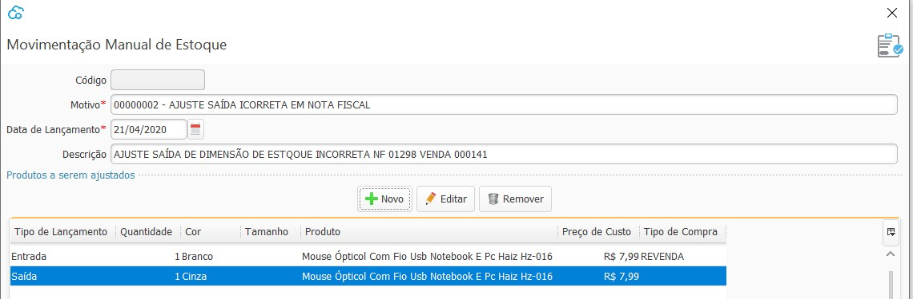
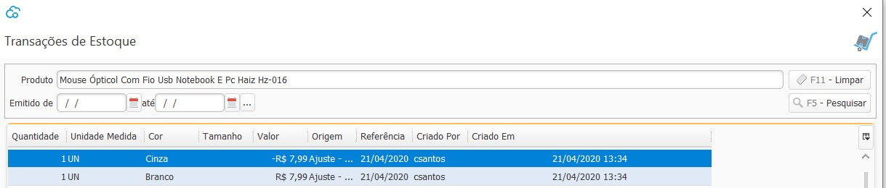

{: #movimentacaomanual}

### Movimentação Manual de Estoque

Nesta tela podem ser inseridas todas as movimentações de entrada e saída  de estoque que forem além das já feitas nos outros processos do sistema. É importante ressaltar que toda movimentação de estoque deve ser baseada em um documento fiscal. 

No exemplo abaixo, é feito um ajuste de estoque de uma Venda onde foi faturado o item com a dimensão de estoque errada. Foi feita a venda do Mouse com a dimensão de Cor Branco, mas o correto seria a Cor Cinza, então faz-se a entrada do mouse branco e a saída do mouse Cinza. 

Após o lançamento da movimentação manual de estoque a transação aparece nas transações de estoque com origem: Ajuste

Emissão é a data que a transação aparecerá no banco e também a data de contabilização.

Os motivos devem ser previamente cadastrados no Cadastro de [Motivo de Movimentação Manual de  Estoque](estoque_motivo_movimentacao_manual.md#cadastro).

[Voltar](estoque.md#estoque)

